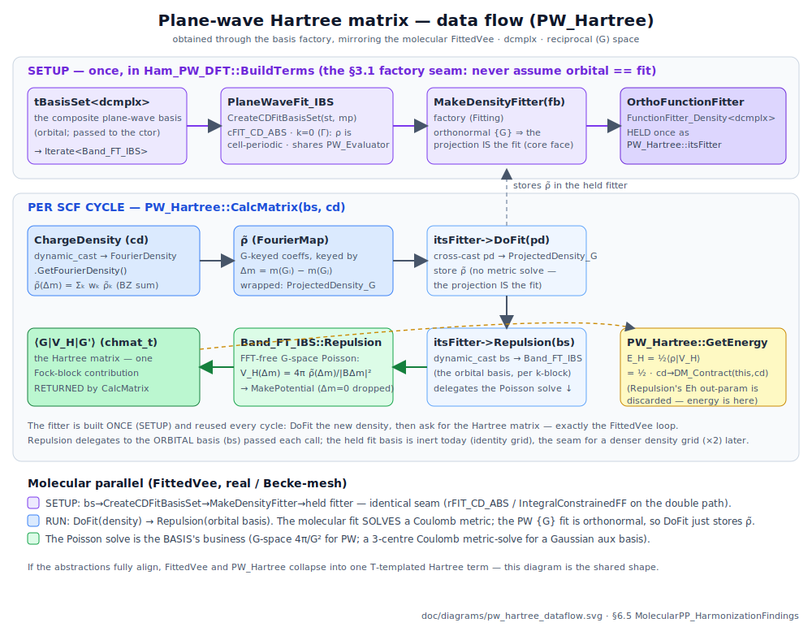

# Molecular Pseudopotentials — Interface Divergence & Harmonization Findings

Companion to `doc/MolecularPseudopotentialPlan.md` (user-owned; not edited). This is **goal 2** of the
Molecule_PP project: *having got it working (goal 1), record the interface divergences it exposed between
the molecular (`src/BasisSet/Molecule`) and plane-wave (`src/BasisSet/Lattice_3D`) sides, and the concrete
path to harmonizing them* — in service of the long-term goal of hoisting structure-neutral code up into
`src/BasisSet`.

Status: Si₂ molecular PP + multi-species (O–Si) routing converge through the `qchem::Calculation` facade;
both pseudo-atoms (Si, O) validated. Full UTMain green. **Both harmonization items are landed through their
term/Hartree level — see §6** (PP harmonization, the real-space lattice mesh + `L_PP`, all four fit-basis/fitter
interface axes, and — §6.5 — the PW density-fit **Hartree** routing through the factory via a shared `PW_Evaluator`,
bit-identical). **§7 is the remaining wiring**: a lattice-PP SCF (Item 1) and the PW **XC** face (Item 2). The map
below still orients the two convergence points.


## 1. The headline divergence: *where* PP assembly lives

| | assembly site | reached via | term(s) |
|---|---|---|---|
| **PW** (`Lattice_3D`) | the **basis** — `Integrals_Pseudo<dcmplx>` on `PlaneWave_IBS` | `dynamic_cast` basis→capability, `MakeLocalPotential`/`MakeSeparablePotential` | one: `PW_Pseudo` |
| **molecular** (`Molecule`) | the **term** — `Structure::CreateIntegrationMesh` + generic `qcMesh` quadrature | nothing (term asks the geometry for its mesh) | two: `PP_Local`, `PP_NonLocal` |

`Integrals_Pseudo<T>` is realized **only** by the PW basis (`<dcmplx>`); there is **no `<double>` impl**. The
molecular path never touches it. So the plan's §1/§3 vision ("molecular realizes `Integrals_Pseudo<double>`")
was superseded by assembly-in-the-term. Net: two assembly sites — but the molecular one is now geometry-neutral
(see §3), so unifying is a matter of teaching a *real-space lattice* to produce a mesh (§7 item 1), not writing
a molecular `Integrals_Pseudo`.

## 2. The key realization: the mesh already lives behind the `Fit_ABS` network

The molecular "assembly-in-the-term" is **not** the molecular convention — it is `PP_Local` being the odd
one out. Molecular XC assembly is *already* structure-neutral and mesh-hidden:

- `Fit_IBS` owns `qcMesh::Mesh itsMesh` + `SetMesh(Structure, MeshParams)` (`src/BasisSet/Fit_IBS.C`).
- `FIT_SF_ABS::Overlap(const Sf& f)` projects an **arbitrary scalar field** onto the fit basis over that
  mesh — the fit basis does the quadrature.
- `FunctionFitter_Scalar<T>` / `FunctionFitter_Density<T>` are structure-neutral templates, each with a
  molecular (Becke-mesh) impl **and** an orthonormal G-space impl (`OrthoScalarFitter` / `OrthoFunctionFitter`).
  `FittedVxc` holds a fitter, hands it a `ScalarFunction`, gets a matrix back, and **never sees a mesh**.

So the tension "the molecular *orbital* basis would have to become mesh-aware to realize
`Integrals_Pseudo<double>`" is a **false framing**: mesh-awareness belongs in the `Fit_ABS`/fitter network,
which both PW and molecular already populate.

## 3. Harmonization target (the two PP integral types) — ✅ DONE

Route PP assembly through the geometry's mesh + generic `qcMesh` quadrature. Two neutral primitives, each
with a molecular Becke-mesh impl and a PW G-space impl:

- **(a) scalar-field → operator matrix** `⟨χᵢ|V(r)|χⱼ⟩` (local PP). ✅ **DONE.** The right abstraction turned
  out to be the **mesh on the geometry**, not a field-operator capability on the basis:
  **`Structure::CreateIntegrationMesh(mp)` (pure virtual)** — each geometry owns its most efficient mesh
  (`Atom` → single-centre radial×angular, `Molecule` → multi-centre Becke, `UnitCell` → uniform/unit-cell-Becke,
  which currently throws; PW never asks — it owns its G-grid). No central `if/case` (SOLID).
  `PP_Local::CalculateMatrix` calls that virtual and quadratures with generic `qcMesh::WeightedOverlap(mesh,
  basis, V_loc)` — geometry-neutral, **no `dynamic_cast`**. V_loc is static + smooth, so this is raw quadrature
  (no fit), correctly distinct from the density/potential *fitter*. Bit-identical.
  *(An earlier iteration routed this through a `Mesh_Integrated_IBS`/`MeshIntegratorSource` basis capability;
  removed as over-abstraction once the mesh lives on the geometry.)*
- **(b) scalar-field → projection vector** `⟨χᵢ|β_p Yₗₘ⟩` (nonlocal KB). ✅ **DONE.** Same pattern: the
  projection primitive `qcMesh::Overlap(mesh, basis, β_p·Y_lm) → b` already existed and is generic, so the only
  coupling was the mesh source. `PP_NonLocal::CalculateMatrix` now calls `Structure::CreateIntegrationMesh`
  and builds each projector's `b`, accumulating rank-1 `D|b⟩⟨b|`. Bit-identical (`Si_PP_U` KB test −3.3369).

Both PP terms now assemble on the geometry's mesh with generic `qcMesh` quadrature. That is what makes the
molecular↔lattice unification (§7 item 1) a small step rather than a rewrite.

### 3.1 HARD CONSTRAINT: the fit basis is GENERATED BY the orbital basis (the *process* matters)

The fit basis must be produced by the orbital basis through its own factory methods:

```cpp
virtual FIT_CD_ABS* CreateCDFitBasisSet (const Structure*, const qcMesh::MeshParams&) const;  // density-fit basis
virtual FIT_SF_ABS* CreateVxcFitBasisSet(const Structure*, const qcMesh::MeshParams&) const;  // potential-fit basis
```

The **molecular** path honours this: `FittedVee`/`FittedVxc`/`Ham_PP` call `bs->CreateXxxFitBasisSet(...)`,
get back a *distinct* `FIT_*_ABS`, and build the fitter on it — the orbital basis is the FACTORY of its fit
basis (a real, separately-tuned auxiliary basis).

The **PW** path VIOLATES this and must NOT be copied:
- `tBasisSet<dcmplx>::CreateCDFitBasisSet` / `CreateVxcFitBasisSet` are `assert(false)` stubs
  (`src/BasisSet/Imp/BasisSet.C`).
- `PW_Hartree`/`PW_XC` (`src/Hamiltonian/Internal/Imp/PWTerms.C`) instead **default-construct** a
  `FourierFunctionFitter` and hand it the *orbital* basis directly — hardcoding "fit basis ≡ orbital basis"
  and bypassing the generating process.

**The clean target (§7 item 2):** PW *implements* `CreateCDFitBasisSet`/`CreateVxcFitBasisSet` (the DFT/
`Band_FT_IBS` side, with the composite delegating as the `<double>` path already does). PW is free to *return*
itself, or a more efficient tuned-{G} fit basis — but the caller always goes THROUGH the factory. `PW_Hartree`/
`PW_XC` then obtain their fitter exactly as `FittedVee`/`FittedVxc` do:
`MakeXxxFitter(bs->CreateXxxFitBasisSet(...))`. The `assert(false)` stubs die; the process is uniform even when
PW's answer is trivial.

This constraint governs the whole harmonization: whenever a fit/auxiliary structure is needed, obtain it from
the orbital basis via its factory method — never assume the orbital basis IS the fit/aux basis. (For the raw
field→operator primitive (a) there is no fit basis at all — direct `⟨χ|V|χ⟩` quadrature; the concern applies
to any density/potential *fit* the assembler performs.)

## 4. Smaller divergences found

- **`PseudoG0Energy` — ELIMINATED this session.** The PP-specific G=0 alignment `(N/Ω)·Σₐ α` moved off the
  `Integrals_Pseudo` basis interface into the `PW_Pseudo` term (which reads Ω from `UnitCell::GetCellVolume()`
  and α from the model it already owns). `Integrals_Pseudo<T>` is now two clean universal matrix methods.
  **G=0 is unifiable, not a principled asymmetry:** a finite molecule drops *nothing* at G=0 (the real-space
  mesh integrates the full `V_loc(r)`, including its `−Zion/r` tail), so the alignment is *physically* zero.
  A unified PP term would carry `Ealign = 0` for a finite structure and `(N/Ω)Σα` for a periodic one — exactly
  what `PW_Pseudo` already does via its `dynamic_cast<UnitCell>` guard. So the molecular value is a correct
  hardcoded `0.0` (like `Vnn`'s identity `zionOf` default), giving a uniform interface.
- **`PW_IonIon` vs molecular `Vnn` — a T-template candidate.** Both are energy-only ion-ion terms delegating
  to `NuclearRepulsion(st, zionOf)`; they differ only in scalar type (`chmat_t` vs `rsmat_t`). This session
  unified the **Zion callback** onto `Vnn` (one term serves all-electron via an identity default and PP via a
  Z→Zion map, mirroring `PW_IonIon`). A future `IonIon<T>` term could collapse the two entirely.
- **Electron-count coupling (wart).** `Ham_PP`/`FittedVee` read the valence count from `st->GetNumElectrons()`,
  forcing the "atom charge = Z−Zion" encoding (real atoms carry charge 0). The facade absorbs it via
  `MakeValenceStructure`, but a cleaner design passes the count/EC explicitly rather than deriving it from
  structure net-charges.
- **Basis provenance — real GTH bases now in.** All-electron `.bsd` files (e.g. `dzvp`) carry core shells that
  are inconsistent with a PP. Real CP2K `SZV-GTH`/`DZVP-GTH` (Si+O) were downloaded + converted to Gaussian94
  (`szvgth.bsd`, `dzvpgth.bsd`). Residual: my *segmented* split of CP2K's general contraction puts a diffuse
  function on the same exponent as a contracted primitive → near-linear-dependence; a cleaner conversion (or a
  well-conditioned basis) is the last bit (ties to §5.1).

## 5. Multi-species molecular PP (DONE) + the convergence follow-up it exposed

Multi-species molecular PP works end-to-end: `Ham_PP(st, {{elem,q}…})` + `Hamiltonian::Factory(Pol, st, species, …)`
build one `MultiSpecies_Local` + one `MultiSpecies_Separable` per-Z router (mirroring the PW `BuildFromGTH`),
and the facade (`MakeValenceStructure` per-atom `Z−Zion`, `PPSpecies` distinct-species list) routes any
molecule — single species is the 1-element case (Si tests still bit-identical). The terms already indexed on
the atoms' `itsZ`, so each atom gets its own local + KB potential and its own `Zion` for the ion-ion.
Validated by `A_PP.OSi_PP_U.MultiSpeciesRouting`: **`Enn = Zion_O·Zion_Si/R = 6·4/R` exactly** (a mis-route
would give 16/R or 36/R) — a convergence-independent proof of per-species routing.

### 5.1 Convergence hardening — infrastructure DONE; the atoms converge; the blocker is accelerator/LA

Chasing hetero-molecule energies drove a convergence-hardening pass. Three pieces landed as **correct,
committed infrastructure**:
1. **Spin-native PP Hamiltonian** — `Ham_PP_U` → **`Ham_PP`**, now `Pol`-parameterized: polarized uses
   `FittedVxcPol` + `FittedVcorrPol` (open-shell/magnetism), unpolarized is the ζ=0 collapse (bit-identical
   default). Tenet `[[feedback_spin_polarized_primary]]` applied to PP — forcing O into a closed-shell singlet
   was the wrong, hard state. `Factory(Pol, …)` + both facades thread `pol`.
2. **Accelerator selection on the facade** — `AcceleratorOptions.type` = `"DIIS"|"GDM"|"Ladder"`.
3. **Real GTH bases** — CP2K `SZV-GTH`/`DZVP-GTH` (see §4 "Basis provenance").

**The PP is sound — the O pseudo-atom converges cleanly.** Via the purpose-built ATOM path (`AtomCalculation`,
Slater basis, High accuracy, `PseudoAtom_EC` handling the open-shell 2p⁴), O converges in ~70 ms to
E = −13.9670584, charge = 6, `IsConverged()==true` (`A_PP.O_PP_U.SlaterHigh`). Both pseudo-atoms (Si, O)
validated. **Lesson: use `AtomCalculation` (Slater/High) for a single atom** — not the molecular Gaussian
facade with `Molecule_EC` closed-shell.

The molecular-facade throw is an isolated MOLECULAR issue in the **accelerator/LA layer** (not PP): `Molecule`
PP with the hand-converted GTH bases throws *"Invalid setup of symmetric matrix"*. gdb:
`SCFAcceleratorDIIS::UseFD` → `LASolverCholesky::Transform` → `make_hermitian`
(`src/LASolver/Internal/Imp/LASolverLapack.C:23`) wraps a Cholesky-transformed matrix containing **NaN/Inf**
(near-singular overlap) in a Blaze `SymmetricMatrix`. Two contributing fixes, both separable from PP: a
properly-conditioned molecular basis (cleaner DZVP conversion), and a robust orthonormalization
(canonical / level-shifted) in the accelerator/LASolver. Not blocking (the atoms converge). (Do NOT cite the
old "N5" repro — N5 is a test-only tiny pool, invalid for SCF; see `[[feedback_scf_accuracy_levels]]`.)

## 6. What has landed

### 6.1 PP harmonization (goals 1 & 2)
1. `PseudoG0Energy` eliminated (A0 closeout; PW bit-identical).
2. `Vnn` gained an optional Z→Zion callback (all-electron default = identity) — one ion-ion term for both.
3. `Ham_PP` takes the **combined** `LocalPotential` (real-space view for `PP_Local` + `Zion` for `Vnn`).
4. Molecular PP through `qchem::Calculation` facade `{.pseudopotential=true}`; Si₂ + multi-species O–Si.
5. Harmonization (a)+(b): both PP integral types routed on `Structure::CreateIntegrationMesh` (pure virtual)
   + generic `qcMesh` quadrature; `MolecularMesh` module folded into `Molecule.C` and deleted.
6. Spin-native `Ham_PP` (`Pol`), facade accelerator selection, real CP2K GTH bases, both pseudo-atoms pinned.

### 6.2 Item 1 — real-space lattice PP (DONE at the term level)
- **Uniform lattice mesh.** `UnitCell::CreateIntegrationMesh(mp)` builds the uniform real-space grid over the
  cell: `mp.nUniform` points/axis at cell-fractional midpoints `f=((i+½)/n,…)` mapped by `ToCartesian` (`r=Af`),
  equal weight `Ω/n³` — the midpoint rule, exact for smooth cell-periodic integrands. `nUniform` (default 20)
  added to `qcMesh::MeshParams` + folded into `ID()`. Tests `LatticeMesh.*`. (Adaptive unit-cell Becke grid =
  future refinement; the uniform grid is the working mesh.)
- **The mesh's first client (GPW seed).** `PP_Local`/`PP_NonLocal` assemble on a `UnitCell`'s uniform mesh with
  **no change** (they index on `itsZ`, quadrature on the structure's mesh). `L_PP.*` (`UnitTests/L_PP.C`) proves
  it: the SAME Si valence Gaussian basis + GTH-LDA q4 PP gives the SAME `PP_Local`/`PP_NonLocal` matrices whether
  the atom is a finite `Molecule` (Becke) or centred in a large `UnitCell` (uniform), `‖ΔM‖_F/‖M‖_F < 1e-2`
  (`⟨χ(R)|V(·−R)|χ(R)⟩` is translation-invariant → they converge). Empirical proof that *the pure PW path never
  calls `CreateIntegrationMesh`* (it owns its G-grid) and the geometry-neutral terms are the shared code.
  `Vnn(zionOf)` on a `UnitCell` already routes through Ewald (`PlaneWaveDFT.VnnPeriodicUsesEwald`).
- **LSP-clean G=0 alignment.** `PW_Pseudo::GetEnergy` no longer downcasts `Structure`→`UnitCell`. Ω is **not** a
  `Structure` getter (`CellVolume()` isn't a fair question for an `Atom`/`Molecule` — LSP); instead the new
  **`Structure::SumFormFactors(const std::function<double(int)>&)`** answers the fair Σₐf(Zₐ) — `Atom`/`Molecule`
  the honest sum, `UnitCell` folding in `/Ω`. The physics (a finite structure has no periodic background, so
  `Ealign=0`) stays in the term via `!isFinite()`; a periodic cell gets `Ealign = N·SumFormFactors(FormFactorG0)`.

### 6.3 Item 2 groundwork — the four fit-basis/fitter axes (DONE, all bit-identical, 172/172)
The plan's original "PW `CreateCDFitBasisSet` returns `this`" was an **SRP violation** (the orbital basis
`Band_FT_IBS` masquerading as its own fit basis — faces even collide on `Overlap()`). Fixing it revealed the
faces baked in *molecular* assumptions (metric-solve + real functions) that forced an orthonormal/PW fitter to
NA-stub what it can't do. Resolved by four orthogonal **ISP/representation splits** — each a self-documenting
*name*, no behaviour change:
- `23c75df4` — neutral **`ProjectedDensity<T>`** (the `DoFit` argument): the AO `rvec_t` and G-space map stay
  each impl's PRIVATE container; no lattice/"Fourier" type leaks into the neutral face. (2b, `DoFit(tChargeDensity<T>)`,
  is impossible — `qcChargeDensity→qcFitting` already; the reverse is a linker-forbidden cycle.)
- `379e3230` — **`FIT_CD_ABS` → minimal face + `FIT_CD_NonOrtho`** (the *metric* axis): Coulomb metric-solve
  inputs (`Charge`/`Repulsion`/`InvRepulsion`, sole consumer `ConstrainedFF`) move to the `NonOrtho` refinement.
- `8a62f22d` — **`FunctionFitter_Density` → core + `_NonOrtho`** (same split, at the fitter): core `{DoFit,
  Repulsion, Write}` + `_NonOrtho` adds self-energy/charge/rescale + the `ScalarFunction` value `FittedCD` uses.
  Deleted dead `FitMixIn`/`FitGetChangeFrom`. The coming PW ortho fitter implements only the core — **no stubs**.
- `3439d3d2` — **`FIT_CD_ABS<T> : IrrepBasisSet<T>`** (the *representation* axis): `rFIT_CD_ABS`=`<double>` (real
  Gaussians), `cFIT_CD_ABS`=`<dcmplx>` (honest complex `e^{iG·r}`, no NA `op(r)`). *Insight:* the aux basis is
  distinct because of **fit tuning** (ρ-fit exponents ×2, Vxc ×2/3; PW: a denser `{G}`, ×2 for ρ), NOT
  orthonormality — so PW **does** have a fit basis (its tunable `{G}` grid); metric and tuned-basis are
  orthogonal axes. The `r`/`c` alias keeps the wide ripple to one char per reference.

All four interface axes (representation × metric × core/refinement × projection) are split and clean — the PW
density-fit basis (`cFIT_CD_ABS`) + ortho fitter can now be written implementing ONLY what they genuinely do.

### 6.4 Grid resolution: `nUniform` vs `Ecut` (analysis — must be Nyquist-consistent once they meet)
`nUniform` (the uniform-mesh points/axis, real-space spacing `a/n`) and `Ecut` (the plane-wave kinetic
cutoff, `|G|²/2 ≤ Ecut` ⇒ `G_max = √(2 Ecut)`) both set a real-space length scale (atomic units are kind
here). They are **independent today only because they serve disjoint code paths**: `Ecut` sizes the PW
basis's *own internal FFT grid* (Nyquist-pinned so the transform is alias-free), while `nUniform` sizes the
integration mesh that the *real-space* PP terms use — and, per step 2, those two grids never meet the same
integrand yet (PW never calls `CreateIntegrationMesh`).

They **couple the moment a band-limited PW-bandwidth quantity is integrated on the uniform mesh.** The
midpoint rule integrates `e^{iG·r}` *exactly* (→0 for `G≠0`) only while `n` out-resolves the integrand's
highest G, i.e. `n·2π/a > G`. So to be alias-free for wavefunction bandwidth `G_max`:
\f[
  n_\text{Uniform} \;\gtrsim\; \frac{a\,G_\text{max}}{\pi} \;=\; \frac{a\sqrt{2 E_\text{cut}}}{\pi},
\f]
and for a **density** (`|ψ|²` doubles the bandwidth — the usual "density cutoff = 4× wavefunction `Ecut`")
another factor of 2. It is an **inequality, not an equality**: below it you alias; above it you only spend
extra points (harmless).

**Design consequence.** Keep them as *separate knobs* (different terms have different smoothness — soft
`V_loc` needs far fewer points than the wavefunction bandwidth implies; sharp KB `β_p Y_lm` near the core may
need more; lock-stepping to `Ecut` would over/under-resolve). BUT in the mature real-space-basis-on-a-lattice
implementation — this is exactly **GPW** (cf. CP2K `CUTOFF`/`REL_CUTOFF`) — `nUniform` should **not** be a
free integer the user sets: **derive it from a grid `Ecut` via the Nyquist bound above**, so the collocation
quadrature is alias-free *by construction*. `nUniform=20` is a stand-in default precisely because step 2 has
not yet brought the two grids together; the moment it does, replacing that default with an `Ecut`-derived `n`
is the correct move.

### 6.5 Item 2 Hartree — PW density-fit through the factory (DONE, bit-identical)
The plane-wave **Hartree** half of Item 2 is landed: `PW_Hartree` now obtains its density fitter **through
the basis's factory**, never assuming `orbital == fit` (§3.1). A key review insight reshaped the approach —
the new PW density-fit basis must be a *concrete* `cFIT_CD_ABS : IrrepBasisSet<dcmplx>`, so rather than
duplicate the plane-wave `op(r)`/grid logic, we adopted the codebase's **evaluator pattern** (the templated
IS-A `EOrbital_1E_IBS<E>` mixins, *not* composition):
- **`PW_Evaluator`** (`src/BasisSet/Lattice_3D/Evaluators/PW/`, its own folder as the molecule side has) —
  the plane-wave grid engine: the data (`B,k,Ecut,{G}`) in one place plus the shared evaluation tier
  (`op(r)`/`Gradient`, overlap/kinetic matrices, `MakePotential`, the FFT grid). Templated mixins
  `EPW_Irrep_IBS<E>` / `EPW_Orbital1E_IBS<E>` (`Lattice_3D/IrrepBasisSet.C`, module
  `qchem.BasisSet.Lattice_3D.IBS`) forward the interface virtuals to it via `Cast()`. `PlaneWave_IBS` now
  IS-A `PW_Evaluator` (pure relocation; the orbital-only G-space/PP methods stay on it, reading the shared
  data through evaluator accessors). *(The orbital-side rho-tilde→Hartree/FFT-XC assembly could migrate onto
  the evaluator too later — kept concrete for now because the lattice tests drive it directly and it is not
  shared with the fit basis.)*
- **`PlaneWaveFit_IBS`** — a thin `cFIT_CD_ABS` sharing that evaluator (a copy of the orbital grid). **Zero
  stubs**: confirmed the reviewer's point that `cFIT_CD_ABS` inherits neither `Integrals_Overlap` nor
  `Orbital_1E_IBS`, so it needs **no** `MakeOverlap`/`MakeKinetic`/`MakeNuclear` — only `op()/Gradient` (from
  the mixin+evaluator) and symmetry (from `IrrepBasisSetImp`).
- **The factory seam.** `CreateCDFitBasisSet`'s return type templated `rFIT_CD_ABS*` → `FIT_CD_ABS<T>*` (a
  no-op for the double/molecular path); new `Band_FT_IBS::CreateCDFitBasisSet` (the reciprocal-space analog
  of `Orbital_DFT_IBS::CreateCDFitBasisSet`), implemented by `PlaneWave_IBS`; the
  `tBasisSet<dcmplx>::CreateCDFitBasisSet` **`assert(false)` stub deleted** — it now delegates to the
  `Band_FT_IBS`, exactly as the double path delegates to `Orbital_DFT_IBS`.
- **The fitter.** `ProjectedDensity_G` (a real wrapper replacing the misnamed `ProjectedDensity_FT` alias)
  keeps the G-keyed `FourierMap` off the neutral `ProjectedDensity<dcmplx>` face. `OrthoFunctionFitter`
  (`Fitting/Internal`) implements **only** the core `FunctionFitter_Density<dcmplx>` (no NA-stubs); reached
  via a new `MakeDensityFitter(cFIT_CD_ABS)` overload. `PW_Hartree::CalcMatrix` routes
  `bs → Band_FT_IBS → CreateCDFitBasisSet → MakeDensityFitter → DoFit(ProjectedDensity_G) → Repulsion(bs)`
  (at CalcMatrix time — the PW Hamiltonian is built without the basis). `FourierFunctionFitter::Repulsion`
  (its only user) removed; the XC-only `Overlap` remnant stays for `PW_XC`.

The fitter is built **once** (in `Ham_PW_DFT::BuildTerms`, which now takes the composite basis — mirroring
the molecular DFT ctors that take `bs` for `FittedVee`) and reused every SCF cycle: `DoFit` the new density,
then ask for the Hartree matrix. The fit basis is a **Γ (k=0)** plane-wave set (the density is cell-periodic),
not the orbital block's k.

All bit-identical: the 26 PW/Lattice energy anchors, 172/172 UTMain, 29/29 UTLattice_3D_BS.

The data flow (and its FittedVee parallel):



\image html pw_hartree_dataflow.svg "Plane-wave Hartree matrix evaluation: obtained through the basis factory, mirroring FittedVee."

### 6.6 Item 2 XC — PW Vxc through the factory; `FourierFunctionFitter` RETIRED (DONE, bit-identical)
The XC (overlap-metric) half now mirrors the Hartree half, and the **last user of `FourierFunctionFitter`
is gone — that class is deleted**. `PW_XC` runs behind the same `FunctionFitter_Scalar<dcmplx>` face the
molecular `FittedVxc` uses.
- **`FIT_SF_ABS<T>` templated on the representation axis** (rFIT_SF_ABS/cFIT_SF_ABS, mirror of `FIT_CD_ABS<T>`)
  — and its core reduced to the empty `IrrepBasisSet<T>` marker, with the overlap metric (`Overlap(Sf)`/`Norm`/
  `InvOverlap` + `Integrals_Overlap`) moved to **`FIT_SF_NonOrtho`**. So `cFIT_SF_ABS` is a clean empty marker;
  the PW Vxc fit basis carries **no stub** (the molecular `<double>` ripple is a mechanical rename).
- **`ProjectedScalar<T>`** (+ `ProjectedScalar_AO` = the renamed `ScalarFFClient`, + `ProjectedScalar_G` wrapping
  the potential's V-tilde) mirrors `ProjectedDensity<T>`; the scalar `DoFit` is neutralized to it. The scalar
  fitter face is split **core / `_NonOrtho`** (the core drops the `ScalarFunction` base, so the ortho scalar
  fitter has no eval stub) — the exact `FunctionFitter_Density` split.
- **`OrthoScalarFitter`** (core `FunctionFitter_Scalar<dcmplx>`, Fitting/Internal) stores the V-tilde and
  delegates the kernel-free assembly to `Band_FT_IBS::Overlap`; reached via a new `MakeScalarFitter(cFIT_SF_ABS)`.
  `PlaneWaveFit_IBS` now implements **both** `cFIT_CD_ABS` and `cFIT_SF_ABS` (like molecular `EFit_IBS`);
  `Band_FT_IBS::CreateVxcFitBasisSet` returns a distinct Γ instance; `PW_XC(xc, fbs)` is built once in
  `BuildTerms`. `FourierFunctionFitter.C` + its CMake entry + the `PWTerms` import are removed.

**Scope note (grid deferral).** A genuinely distinct **denser** Vxc fit grid changes `Exc` (the nonlinear
`v_xc` aliases onto a coarse {G}), so it cannot be bit-identical. Per the plan, this stays on **today's grid**
(the Vxc fit basis reuses the orbital grid, like the CD one), keeping every anchor bit-identical; the denser
{G} is a **future joint CD+Vxc grid upgrade** (both fit bases' `{G}` adjusted together). All bit-identical:
26 PW/Lattice `Exc` anchors, 172/172 UTMain, 29/29 UTLattice_3D_BS.

## 7. Action items for the next session (remaining)

**Item 2 (the PW DFT-fit harmonization) is DONE end to end** — Hartree (§6.5) and XC (§6.6), `FourierFunctionFitter`
retired. What remains is a lattice-PP SCF (Item 1) and the *(future)* denser-{G} fit-grid upgrade. Neither blocks
current PP use. **Note:** PW itself keeps `Integrals_Pseudo<dcmplx>` + its intrinsic G-grid — the G-space FFT route
is principled and efficient; unification is for real-space bases on a lattice, not for plane waves.

### Item 1 remaining — full lattice-PP *energy* (SCF)
The terms already assemble on the lattice mesh (§6.2). Left for a real *energy*:
1. A real-space-basis **SCF on a `UnitCell`** — periodic images / Bloch sum of the Gaussians, + teach the
   `qchem::Calculation` facade to **preserve the concrete geometry** (it currently deep-copies to `Molecule`,
   stripping periodicity). A larger increment than the term-level mesh validation.
2. *(Future, once a unified PP term across `T` is wanted)* fold `PW_IonIon`/`Vnn` into a single `IonIon<T>` carrying
   the G=0 alignment (`0` for finite, `(N/Ω)·ΣFormFactorG0` for periodic — the hardcoded-0.0 pattern).
3. *(Future GPW)* derive `nUniform` from a grid `Ecut` via the Nyquist bound (§6.4) rather than a free integer.

### Item 2 — DONE (Hartree §6.5, XC §6.6)
Both PW DFT-fit routes go through the factory seam; `FourierFunctionFitter` is deleted. The only follow-ups are
future upgrades, not remaining harmonization work:
1. **Denser-{G} fit grid (future, joint CD+Vxc).** A genuinely distinct, denser Vxc/CD fit grid is the physically
   better XC/Hartree quadrature (CP2K-style density cutoff) but changes the numbers, so it lands as one deliberate
   numerics upgrade — both fit bases' `{G}` adjusted together — separate from this bit-identical refactor. When it
   lands, `ProjectedScalar_G`'s flat-vec view (over the fit basis's own ordered `{G}`) becomes meaningful.
2. *(Deferred cleanup, reviewer)* move the `Overlap`/`MakeOverlap` pair up from `Integrals_Overlap`/`IrrepBasisSet`
   into `Orbital_1E_IBS` so `FIT_*_ABS` cores provably never carry an overlap metric.

**Constraint:** never assume `orbital == fit` (§3.1); the factory is the seam even when PW's answer is trivial.
