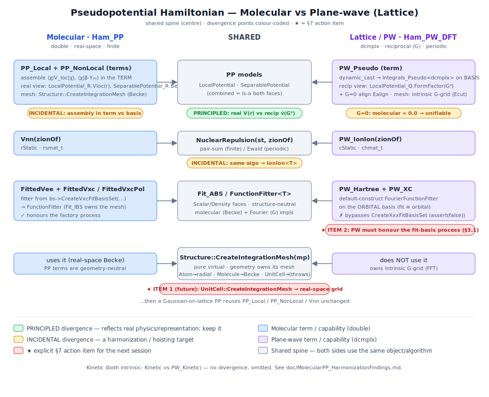

# Molecular ↔ Plane-Wave Pseudopotential Harmonization — Round 2 (the road to GPW)

**Status:** planning doc for the *next* session. Self-contained. Author-owned (like
`doc/MolecularPP_HarmonizationFindings.md`, "Round 1"); **not** the user's
`doc/MolecularPseudopotentialPlan.md`. Round 1 got molecular pseudopotentials working and harmonized the
*fitting/assembly* seams; Round 2 closes the last structural divergences and lays the track to **GPW**
(Gaussian orbitals on a periodic lattice), which is the north-star that makes solids/battery work possible.

---

## 0. Orientation (read this first — the doc is otherwise standalone)

Two pseudopotential (PP) code paths exist today and they must eventually share as much machinery as possible:

- **Molecular** (`src/Hamiltonian`, `double`, real-space, finite geometry): the external PP is assembled in the
  **term** — `PP_Local` (local part `⟨χᵢ|V_loc(r)|χⱼ⟩`) and `PP_NonLocal` (Kleinman–Bylander separable part
  `⟨χᵢ|β_p Yₗₘ⟩`), each quadratured on the geometry's own integration mesh.
- **Plane-wave / lattice** (`src/BasisSet/Lattice_3D` + `src/Hamiltonian/…/PWTerms.C`, `dcmplx`, reciprocal
  space, periodic): the PP is assembled in the **basis** — `PlaneWave_IBS` realizes
  `Integrals_Pseudo<dcmplx>` (structure factor `e^{-iG·τ}`, `1/Ω`, form factors), reached from the
  `PW_Pseudo` term by a `dynamic_cast` across abstract faces.

They already share a **spine** (this is what Round 1 established or confirmed):

| Shared object / algorithm | Role |
|---|---|
| `LocalPotential` / `SeparablePotential` (`src/Pseudopotential`) | the PP **models** (real + reciprocal views); both sides consume the same model |
| `Structure::CreateIntegrationMesh(mp)` (pure virtual) | each geometry owns its most efficient real-space mesh: `Atom`→radial×angular, `Molecule`→Becke, `UnitCell`→uniform grid. PW never calls it (owns its G-grid). |
| `Structure::SumFormFactors(f)` + `isFinite()` | the neutral G=0 alignment seam (finite → 0; periodic → folds in `1/Ω`), no `dynamic_cast<UnitCell>` |
| `NuclearRepulsion(st, zionOf)` | one ion-ion algorithm: pair-sum (finite) / Ewald (periodic); both `Vnn` and `PW_IonIon` delegate |
| `Fit_ABS` factory + `FunctionFitter_{Scalar,Density}<T>` | density/potential fitting; **both** sides now obtain their fitter through `bs->Create{CD,Vxc}FitBasisSet(...)` (Round 1 Item 2 — PW no longer assumes `orbital == fit`; `FourierFunctionFitter` retired) |

The map (colour-coded; **✓** = harmonized, **◐** = partly done, amber = the divergences this doc plans):



**What Round 1 finished** (so we don't re-open it): `PseudoG0Energy` eliminated; `Integrals_Pseudo<T>` reduced
to two clean matrix methods (PW-only, `<dcmplx>`); both molecular PP terms made geometry-neutral on
`CreateIntegrationMesh`; multi-species routing; spin-native `Ham_PP` (`FittedVxcPol`/`FittedVcorrPol`, now pinned
by `A_PP.Si_PP_U.Polarized`); the whole PW DFT-fit path routed through the basis factory (Hartree + XC), with the
uniform `UnitCell` mesh + `L_PP` term-level validation in place. Full detail: `MolecularPP_HarmonizationFindings.md`
§6. **The "LASolver blocker" of Round 1 §5.1 was a red herring — near-singular basis conditioning, not a solver
bug; use a well-conditioned basis (Slater/High).**

---

## 1. The four remaining "incidental" divergences

"Incidental" = an artifact of how the two sides grew up, not a reflection of real physics (contrast the
**principled** divergence real-space `V(r)` vs reciprocal `ṽ(G²)`, which we *keep*). Each is a harmonization /
hoisting target. They are listed easy→hard; **(A) and (D) are ultimately the same problem, and GPW is what forces
them** (see §2).

**Where each divergence now lands (after GPW prep work 1):**
- **(C)** is **DONE** — peeled off as a standalone template (`IonIon<T>`), independent of GPW. ✅
- **(A), (B), (D)** all **fold into GPW**: (D) is the GPW body (real-space-basis SCF on a `UnitCell`); (A)
  dissolves under it (molecular term path + `UnitCell` mesh *is* the GPW KS-matrix assembly — do **not** pre-empt
  it with a molecular `Integrals_Pseudo<double>`); (B), the G=0 alignment, is a **PP-term** (electron-ion) concern
  that folds into (D)'s unified PP local term (it needs `FormFactorG0`, not an ion-ion quantity — see (C)'s note).
  So GPW is the single forcing function for the last three.

### (B) G=0 alignment — trivially unifiable, do it opportunistically
- **Now:** the PP G=0 term is `0` for a finite structure and `(N/Ω)·Σ_a FormFactorG0(Z_a)` for a periodic one.
  `PW_Pseudo::GetEnergy` already branches on `!isFinite()` and reads the sum from `Structure::SumFormFactors`.
  The molecular side carries a hardcoded `0.0`.
- **Target:** when a single PP term serves all geometries (see (D)), it carries one expression
  `Ealign = isFinite() ? 0 : N·SumFormFactors(FormFactorG0)`. No new abstraction — the seam already exists.
- **Effort:** trivial (folds into (D)). **Risk:** none (bit-identical; finite value is provably 0).
- **Confirmed while doing (C):** this is a **PP-term** (electron-ion) concern, *not* ion-ion — `FormFactorG0`
  is the local-PP model's finite `G→0` limit. It genuinely folds into **(D)** (the unified PP local term), *not*
  into `IonIon<T>`. `PW_Pseudo::GetEnergy` keeps it for now (the seam is right where it is).

### ✅ (C) ~~`IonIon<T>` — collapse `Vnn` and `PW_IonIon` into one template~~

> # ✅ DONE — GPW prep work 1
> Collapsed into `template<class T> class IonIon` (`src/Hamiltonian/Internal/IonIon.C`). `Vnn` + `PW_IonIon`
> deleted; 176/176 UTMain green, per-side anchors bit-identical. Detail below.

- **Now:** `Vnn` (`rsmat_t`, molecular) and `PW_IonIon` (`chmat_t`, periodic) are **the same energy-only term** —
  both add no matrix contribution and delegate to `NuclearRepulsion(st, zionOf)`. They differ only in scalar type.
- **Target:** one `IonIon<T>` term (`T ∈ {double, dcmplx}`), parameterized by the `zionOf` callback
  (identity for all-electron, `Z→Zion` map for PP). Mirrors how the two PP terms already share their model + mesh.
- **DONE:** new module `qchem.Hamiltonian.Internal.IonIon` (`src/Hamiltonian/Internal/IonIon.C`) exports
  `template<class T> class IonIon : tStatic_HT<T> / tStatic_HT_Imp<T>` — fully inline (a template term needs its
  definition visible where instantiated), sitting on the shared `qchem.Hamiltonian.Internal.Term` base where
  **both** the `double` and `dcmplx` term bases are visible (the "different libs" watch-item was actually just a
  module placement). Two ctors: all-electron convenience `IonIon(st)` + PP `IonIon(st, zionOf)`. `Vnn` (class +
  `Imp/Vnn.C`) and `PW_IonIon` (class + impl block) **deleted**; the four build/test sites now say
  `IonIon<double>` / `IonIon<dcmplx>`: `HamiltonianImp::InsertStandardTerms`, `Ham_PP`, `Ham_PW_DFT::BuildTerms`,
  and `PlaneWaveDFT.VnnPeriodicUsesEwald`. **176/176 UTMain green** — the per-side anchors held bit-identical
  (`VnnPeriodicUsesEwald` Ewald Madelung `-8.40046`; `A_PP.Si_PP_U.Polarized` `-3.359597907`; `L_PP` finite==lattice).
- **NOTE — (B) did NOT fold into `IonIon`.** §3.1 said "(B) folded into it," but the G=0 alignment needs
  `FormFactorG0`, which is the **local-PP model** (`PP_Local` / `PW_Pseudo`, electron-ion), not an ion-ion
  quantity — putting it on `IonIon` would be a wrong coupling. So the alignment stayed in `PW_Pseudo` (per the (B)
  section's own authoritative "folds into (D)"). `IonIon<T>` is a pure ion-ion energy term. See (B) below.

### (A) Assembly-in-term vs assembly-in-basis — the headline
- **Now:** molecular assembles in the **term** (`PP_Local`/`PP_NonLocal` + `CreateIntegrationMesh` + generic
  `qcMesh` quadrature); PW assembles in the **basis** (`Integrals_Pseudo<dcmplx>` via `dynamic_cast`).
- **Key insight (do not "fix" by writing a molecular `Integrals_Pseudo<double>`):** the pure PW path is
  *principled* — reciprocal-space assembly on its own G-grid is the efficient, correct thing, and it should stay.
  The molecular term path is *also* principled and is already geometry-neutral. They **converge only when a
  real-space (Gaussian) basis lives on a lattice** — that basis will quadrature its PP with the *molecular term
  path on a `UnitCell` mesh*, exactly like a finite `Molecule`. That is GPW. So (A) is **not** a refactor to do
  in isolation; it is **resolved by (D)/GPW**.
- **Effort:** none standalone — it dissolves under (D). **Risk:** the trap is "unify by giving molecular an
  `Integrals_Pseudo<double>`" — explicitly rejected: it would drag reciprocal-space assumptions into the molecular
  basis for zero benefit.

### (D) Full lattice-PP **SCF** — the real increment
- **Now:** the molecular PP terms already assemble correctly on a `UnitCell`'s uniform mesh — proven bit-identical
  by `L_PP` (`UnitTests/L_PP.C`: the same Si valence Gaussian basis + GTH PP gives the same `PP_Local`/
  `PP_NonLocal` matrices whether the atom is a finite `Molecule` or centred in a large `UnitCell`). But there is
  **no periodic SCF** with a real-space basis: two things are missing.
  1. **Periodic Gaussians.** Overlap / kinetic / Hartree of Gaussians on a lattice need Bloch sums
     (`Σ_R e^{ik·R} χ(r−R)`) and lattice-summed two-centre integrals (minimum-image or Ewald-style long-range).
     This is the substantive new numerics.
  2. **The facade must preserve the concrete geometry.** ✅ **DONE (GPW Implementation 1).** `qchem::Calculation`'s
     ctor USED to do `itsStructure = std::make_shared<Molecule>(st)` — deep-copying any structure to a `Molecule`,
     stripping periodicity. It now clones through a new polymorphic `Structure::Clone()` (pure virtual, implemented
     by `Atom`/`Molecule`/`UnitCell` via their copy ctors), so a lattice calculation keeps its `UnitCell` (and its
     `CreateIntegrationMesh` → uniform grid, and `IonIon`→Ewald). `MakeValenceStructure` (PP valence) was likewise
     switched from rebuild-as-`Molecule` to clone-and-mutate-charges, so a PP run on a lattice is preserved too.
     Guarded by `L_PP.FacadePreservesUnitCell`. This was the small, load-bearing **prerequisite for GPW**; the
     substantive new numerics of point 1 (periodic Gaussians) remain.
- **Target:** a real-space-basis SCF on a `UnitCell` reusing `PP_Local`/`PP_NonLocal`/`IonIon` unchanged.
- **Effort:** large (this is the GPW body). **Risk:** medium-high (new periodic-integral numerics); de-risk with
  the term-level `L_PP` bit-identity already in hand and the empty-lattice / cosine-V / bare-Coulomb PW anchors.

---

## 2. Strategic roadmap: GPW → symmetry

The next-steps with the dependency structure made explicit. **GPW (§2.4) is the payoff and the forcing function
for divergences (A)+(D)** — and, per the revised sequencing (§3), it now comes **before** the symmetry work. The
symmetry work (§2.1–2.2) is valuable in its own right but is an **independent optimization/blocking layer** that
bolts onto a working GPW SCF without rework; it does not gate GPW (which runs at Γ / a small explicit k-mesh).

```
        (2.3) PlaneWave_IBS "bad habits" review      ✅ DONE (GPW-prep session)
                 ▼
        (§1.D.2) facade preserves UnitCell           ✅ DONE (Structure::Clone; GPW Implementation 1)
                 ▼
        (2.4) GPW at Γ / small EXPLICIT k-mesh        ← DO NEXT; resolves divergences (A)+(D);
                 │                                       needs NO space-group machinery
                 ▼
        (2.1) symmorphic space groups in qcSymmetry   ← AFTER a working GPW
                 │
         ┌───────┴────────┐
         ▼                ▼
 (2.2a) BZ reduction   (2.2b) SALC with plane waves
 (highest-value        (star-of-G blocking;
  solid speedup;        validates §2.1)
  reduced==full)
         └───────┬────────┘   (both bolt onto a working SCF without rework; neither gates GPW)
```

### 2.1 Symmorphic space groups (foundation)
Extend `qcSymmetry` (which already has molecular point groups + `Lattice_3D`/Bloch machinery — note a qcSymmetry
folder/namespace reorg into `Atom`/`Molecule`/`Lattice_3D` recently landed) with **symmorphic** space groups =
point group ⋉ lattice translations (no screw axes / glide planes). New pieces: the space-group operations
(point op + lattice translation), the **star of k**, the **little co-group** of k, and its small (irreducible)
representations. *Symmorphic-first is the right scoping:* the little group's reps are just ordinary point-group
reps — **no fractional-translation phase / ray (projective) representations**, which is exactly the complexity
that non-symmorphic groups add. Defer non-symmorphic to a later round.

### 2.2a Brillouin-zone reduction (irreducible wedge) — *independent of SALC*
Use the symmorphic space group to fold the k-point mesh to the **irreducible Brillouin zone** and carry per-k
weights, so a periodic SCF only diagonalizes symmetry-distinct k-points. This is the **most broadly useful**
symmetry payoff for solids (it cuts SCF cost directly) and needs only §2.1 — not SALC, not GPW. Clean correctness
check: total energy from the reduced+weighted mesh equals the full-mesh energy.

### 2.2b SALC with plane waves — *independent of GPW*
Symmetry-adapt the `{G}` plane-wave basis: build symmetry-adapted combinations within each **star of G**, block-
diagonalizing the PW Hamiltonian. Mirrors the existing molecular SALC (`SymmetryAdapt`, `ShellRep`,
`OperationRep`) but on `{G}` instead of AO shells. Good, self-contained validation of §2.1 with a crisp check
(symmetry-blocked PW-SCF == unadapted PW-SCF). **Note:** GPW's *variational* basis is Gaussians (adapted by the
point group + Bloch), so SALC-PW is **not** a hard prerequisite for GPW — it's the cheaper way to exercise §2.1.

### 2.3 `PlaneWave_IBS` "bad habits" review — do before GPW

> ## ✅ §2.3 LARGELY DONE — "GPW prep" session
> `PlaneWave_IBS` is now lean and on the atom-style **evaluator pattern**; the review's smells are resolved.
> Shipped, in order (176/176 UTMain green at every step; per-side anchors bit-identical):
> - **`D` never leaks into the basis.** `Band_FT_IBS::MakeFourierDensity(D)` is gone. The basis exposes the
>   **D-free** `Repulsion3C(cFIT_CD_ABS)` / `Overlap3C(cFIT_SF_ABS) → const G_ERI3&` — the reciprocal ERI3
>   analogue `⟨GᵢGⱼ|G_c⟩` (delta support + optional `4π/|G_c|²` kernel), defined as **`G_ERI3` in
>   `qchem.BasisSet.Internal.GMap`** (in **qcBasisSet**, *not* a qcMath type as an earlier draft said). The
>   density contracts `D` itself via `ContractG_ERI3(g, D)` (`IrrepCD<dcmplx>::GetFourierDensity` /
>   `GetRepulsion3C`), exactly mirroring the molecular `GetRepulsion3C`. `GetG_ERI3` and the bare
>   `GetFourierDensity` were retired (XC's ρ̃ now routes through `Overlap3C`).
> - **Poisson machinery deduped.** `AssemblePotential` deleted; the Coulomb kernel `4π/|G|²` moved to
>   `ReciprocalLattice::CoulombKernel`; `Band_FT_IBS::Repulsion(ΔG_Map)` retired.
> - **SAD seed decoupled + renamed** `FourierSeedCD → SeedCD`. It builds a `ScalarFunction<double>` and fits it
>   through a **caller-supplied `Fit_CD_ABS`** (from `CreateCDFitBasisSet`), reaching its analytic
>   structure-factor ρ̃ via `G_FieldEvaluator::MakeFourierDensity` over its **own** fit grid — it never touches the
>   orbital basis. (The analytic form factor, not a 3-D grid FFT, is what avoids aliasing a peaked atomic density.)
> - **`G_ERI3` cached in the shared framework** (`DB_Cache`/`DB_Cache_RAM`, a new `Get(I3C,…)→G_ERI3` overload),
>   not a per-instance member. Keyed by a **cell-aware `BasisSetID`** (B's Cartesian columns appended — `k/Ecut/nG`
>   alone do **not** pin the reciprocal metric the kernel `4π/|G|²` + `1/Ω` depend on; the old member cache could
>   never collide, the shared one can).
> - **`MakeNuclear` + `MakeRepulsion3C`/`MakeOverlap3C` moved onto the PW evaluator** via new concepts
>   `isPW_1E_Evaluator` (renamed from `isPW_Evaluator`, gains `NuclearMatrix`) and `isPW_DFT_Evaluator`
>   (`Repulsion3CTensor`/`Overlap3CTensor`), plus the new `EPW_Orbital_DFT_IBS<E>` mixin — **the exact atom
>   `Orbital_{1E,DFT}_IBS<E>` story**. GPW will supply its own evaluators and reuse the mixins unchanged.
> - **Real-space test oracles removed from the library** (`Overlap`/`Repulsion`/`Integral(ScalarFunction)` → free
>   functions in `UnitTests/PlaneWaveDFTUT.C` over the public grid accessors; no friendship needed).
>
> **What remains on `PlaneWave_IBS`:** ctors, the pseudopotential capability (`MakeLocalPotential` /
> `MakeSeparablePotential` — still live via `Imp/PWTerms.C`), the two fit-basis factories (defer to `GPW_IBS`
> if GPW needs its own fit types), and identity (`Name`/`BasisSetID`/`Write`).
>
> **`G_FieldEvaluator` is ~90% GPW-ready** (see §2.4 point 4).

`PlaneWave_IBS` was coded early and accreted responsibilities that don't belong on a basis. Round 1 already
extracted **one** (fitting: "the basis should not do fits — `qcFitting` does, through a real independent fit basis
set," now honoured via `PlaneWaveFit_IBS` + the factory seam). GPW will lean hard on `PlaneWave_IBS` (it *is* the
reciprocal-space grid engine), so **audit it for the remaining cruft first** — a short, high-leverage cleanup
before building on top. Candidate smells to check (verify against current code — some may already be gone):
- SRP violations: does the basis still own things that are really term/Hamiltonian or fitting concerns
  (density→grid, ρ̃→Hartree/FFT-XC assembly currently kept concrete on it "for now")?
- `dynamic_cast`-reached capabilities that could be a clean abstract face (the CLAUDE.md cast policy).
- Anything assuming Γ-only or a single k where the lattice generalization needs the full k-set.
- Ownership/mesh/grid duplication now that the fitter owns its own grid.
- **✅ DONE — the `MakeFourierDensity(D)` density-matrix leak (was the headline SRP item for this review).**
  **[Names below are an earlier draft — the shipped design is `G_ERI3` / `Repulsion3C`·`Overlap3C` /
  `ContractG_ERI3` in `qchem.BasisSet.Internal.GMap` (qcBasisSet); see the §2.3 DONE banner above for the
  accurate, current picture. The analysis is kept for the record.]**
  Fixed exactly as the molecular precedent: `Band_FT_IBS::MakeFourierDensity(const hmat_t<dcmplx>& D)` is gone;
  the basis now exposes only the **D-free** `GetFourierGather() → const FourierGather&` (a new `qcMath` type —
  the delta-sparse `{G}` 3-centre "integrals" `⟨G_i G_j|Δm⟩ = δ(Δm,G_i−G_j)/Ω`, one bucket per fit function
  `Δm`, lazily cached, the `ERI3` analogue), and `IrrepCD<dcmplx>::GetFourierDensity()` does the `D`-contraction
  via the templated `ContractFourierGather(gather, D)` (mirrors the finite `GetRepulsion3C`). `D` never crosses
  into `qcBasisSet` on either the real-space or reciprocal-space path now. Bit-identical (176/176 UTMain green,
  Silicon SCF anchors + the `Repulsion(MakeFourierDensity(D))` round-trip tests unchanged). *Original analysis,
  kept for the record:*
  `BasisSet::Band_FT_IBS::MakeFourierDensity(const hmat_t<dcmplx>& D)` — and its concrete override
  `PlaneWave_IBS::MakeFourierDensity(const chmat_t& D)` — took the **density matrix** `D` (a `ChargeDensity`
  concept) straight into the `BasisSet` interface; `IrrepCD<dcmplx>::GetFourierDensity()` reached the basis by
  `dynamic_cast<Band_FT_IBS*>` and handed it `itsDensityMatrix`. That was the plane-wave violation of exactly the
  two separations the **molecular** side already achieves, in **both** directions:
  1. **`D` must not leak into the basis.** The molecular DFT-assembly face `Band_DFT_IBS` takes *only* real-space
     `ScalarFunction`s — "the density IS one" — with deliberately **NO getters**; the density matrix never
     crosses into `qcBasisSet`. `Band_FT_IBS` should likewise never see `D`.
  2. **The basis functions must not leak into the density.** The charge density holds a pointer to its orbital
     basis (`IrrepCD<T>::itsBasisSet`, an `Orbital_1E_IBS<T>*`) and asks it exactly two questions — it never grabs
     the raw `{φᵢ}` to hold: **(1)** `φ(r)` as a `VectorFunction` (`(*itsBasisSet)(r)`) to implement `rho.op(r) =
     Σφᵢ Dᵢⱼ φⱼ`; or **(2)** the fit **projection** — cast to `Orbital_DFT_IBS` and call `Repulsion3C(D, fbs)`.
     The reciprocal-space neutral bridge already exists and is the exact analogue of the fit projection: the
     **rho-tilde `ΔG_Map`** — `Fitting::ProjectedDensity_G` already wraps it as the neutral fitter argument and
     `Band_FT_IBS::Repulsion(const ΔG_Map&)` already consumes it cleanly. So it is **only the `D → rho-tilde`
     PRODUCTION** that is misplaced (a basis method that swallows `D`).
  - **The precise fix — mirror molecular's D-free `MakeRepulsion3C` + density-side contraction (option (2) for `{G}`).**
    Molecular's fit projection `⟨ρ|c⟩ = Σ_ab D_ab⟨ab|c⟩` keeps `D` **entirely out of `qcBasisSet`**: the basis
    implements only the **abstract, D-free** `MakeRepulsion3C(c) → ERI3<T>` (the cached 3-centre integral TENSOR
    `⟨ab|c⟩`, keyed by `BasisSetID`, built once) and exposes it via `Repulsion3C(c) → const ERI3&`; the
    `D`-contraction lives on the **charge density**, which owns `D`
    ([IrrepCD::GetRepulsion3C](../src/ChargeDensity/Internal/Imp/IrrepCD.C): `for i: ret[i]=blazem::sum(D % R[i])`).
    (This was cleaned up as the setup for this item — the old `Orbital_DFT_IBS::Repulsion3C(D,c)`/`Overlap3C(D,c)`
    convenience overloads, which had let `D` cross into the basis, were deleted; 176/176 bit-identical.) The
    plane-wave 3-centre integral is just
    the delta `⟨ij|c⟩ = (1/√Ω)·δ(G_c, Gᵢ−Gⱼ)`, so `Σ_ij D_ij⟨ij|Δm⟩ = (1/Ω)Σ_{Gᵢ−Gⱼ=Δm}D_ij` — *is* today's
    `MakeFourierDensity(D)`. It only needs the **same two-way split**: (a) a D-free abstract primitive the concrete
    PW/fit basis implements = the `{G}`-difference gather structure (the delta's support; mirror of
    `MakeRepulsion3C(c)`), and (b) a generic `D`-contraction helper (mirror of `Repulsion3C(D,c)`), driven by the
    `FourierDensity`, which then exposes `rho-tilde` as its face. Net: the concrete φ-owning plane-wave code never
    sees `D`, and rho-tilde is produced by the *same* "contract `D` against cached 3-centre integrals" pattern as
    molecular. (The delta makes the integrals trivial/uncached — but the *interface* is what we're separating.)
  - **Keep** the *other* overload `MakeFourierDensity(const Structure*, formFactor)` — it takes a structure + form
    factor (no `D`), is the density-analogue of `MakeLocalPotential` (the SAD seed), and does not leak.
Output: a ranked list + the cheap ones done, mirroring the Round-1 fitting extraction.

### 2.4 GPW (Gaussian And Plane Waves) — the payoff
**Method (CP2K / Lippert–Hutter):** orbitals in Gaussians (compact, good for core/valence); represent the
electron **density on a regular real-space grid**; FFT to G-space and solve Poisson there for Hartree
(`V_H(G) = 4π ρ(G)/G²`); evaluate XC on the grid; integrate the grid potential back against the Gaussians to form
the KS matrix. This is precisely where molecular and lattice PP **become one code path**:
- The KS matrix element `∫ φ_i V_grid φ_j` **is** `PP_Local`'s `qcMesh::WeightedOverlap(mesh, basis, V)` pattern
  generalized to an arbitrary grid potential `V` — resolving divergence (A).
- Running that on a `UnitCell` with periodic Gaussians is divergence (D).

**What we already have that GPW reuses:** the uniform `UnitCell` real-space mesh; `qchem.FFT`; the reciprocal-space
Poisson/Hartree machinery in `PW_Hartree` (and the Γ PW fit basis + factory seam from Round 1); geometry-neutral
PP terms; `Vnn`→Ewald on a `UnitCell`. **What's genuinely new:** (1) periodic Gaussian two-centre integrals
(Bloch/lattice sums), (2) the **collocate/integrate** pair (Gaussian density-matrix → grid ρ, and grid V → KS
matrix) — CP2K's "collocation", (3) the facade/`Structure` carrying the `UnitCell` through SCF (§1.D.2), (4)
deciding how GPW's grid-sourced Hartree relates to the existing PW density-fit path (they should share the
FFT-Poisson core, differing only in where ρ comes from). This last point connects to the **future denser-{G} fit
grid** already parked in Round 1 (§6.4/§7 there): GPW's density cutoff is the natural place that lands.

**`G_FieldEvaluator` is the shared FFT-Poisson core, and it is ~90% GPW-ready (analysis, GPW-prep session).**
`G_FieldEvaluator` (implemented by `PW_Evaluator`, carried by both the orbital and the fit basis) is really the
**density/potential grid engine** — and putting the density + potential on a plane-wave/FFT grid *is* GPW. Eight
of its nine methods are pure regular-grid ↔ G-space operations that depend only on `(B, Eᵢcut/N, Ω)`, so GPW's
density-grid basis reuses them **in both interface and implementation** (they are basis-agnostic):
`GridPoints`, `ForwardFFT` (ρ(r) collocated → ρ̃(G) — *the* central GPW step), `RhoOnGrid` (Ṽ(G) → V(r)),
`GridCoeff`/`FieldCoeffs`, `Integral` (XC-energy quadrature), `EvalField`/`EvalFieldGradient` (GUI plot), and
`MakeFourierDensity` (the SAD seed = atoms, basis-independent).
- **The one exception is `MakePotential(Vtilde)`** — `⟨Gᵢ|V|Gⱼ⟩ = Ṽ(mᵢ−mⱼ)`, the only method that assumes the
  *orbitals* are plane waves (a Fourier-coefficient lookup). GPW's orbitals are Gaussians, so `⟨gᵢ|V|gⱼ⟩ = ∫ gᵢ V
  gⱼ` is a real-space **collocate-and-integrate** over `GridPoints()` — same role, different mechanism. It is the
  potential→orbital-matrix **bridge**, and it is the plane-wave analogue of exactly what GPW's "integrate" step
  does. Everything `MakePotential` feeds is already orbital-side (`NuclearMatrix`, `LocalPotentialMatrix`, the XC
  `⟨i|v_xc|j⟩` assembly, the moved test oracles).
- **✅ DONE (GPW Implementation 2) — Clean move GPW motivates (not a redesign — a one-method extraction):** pulled
  `MakePotential` off `G_FieldEvaluator` onto the plane-wave **orbital** face, leaving `G_FieldEvaluator` a pure,
  100%-shared density/potential grid engine (a GPW density grid now reuses it wholesale, no PW-orbital assumption
  inherited). Concretely: (a) removed `MakePotential` from `G_FieldEvaluator` (which loses its last `chmat_t`
  return, so its `qchem.Blaze` import went too); (b) added the abstract `Band_FT_IBS::MakePotential` (the
  reciprocal-space DFT-assembly orbital face) — the potential→KS-matrix **bridge**; (c) the evaluator keeps the
  concrete impl but **renamed** `PW_Evaluator::MakePotential → PotentialMatrix` (mirroring its `OverlapMatrix`/
  `NuclearMatrix` siblings — an EVALUATOR method distinct from the interface virtual it feeds, exactly the atom-side
  `OverlapMatrix`→`MakeOverlap` precedent, so the concrete `PlaneWave_IBS` inherits no name clash between the
  `Band_FT_IBS` virtual and the evaluator member); (d) `isPW_DFT_Evaluator` now demands `PotentialMatrix`, and the
  `EPW_Orbital_DFT_IBS<E>` mixin implements `MakePotential` by forwarding to `Cast().PotentialMatrix`; (e) the two
  external call sites (`PW_Hartree`, the XC `OrthoScalarFitter::Overlap`) now cross-cast the orbital basis to
  `Band_FT_IBS` for the assembly (the fit basis stays a `G_FieldEvaluator` for the grid `GridCoeff`/`ForwardFFT`).
  Each orbital evaluator supplies its own potential→matrix bridge — PW: the Fourier lookup; GPW: grid-integrate
  (collocation's adjoint). Same split the §2.3 evaluator work established (grid engine shared; orbital-specific
  assembly on the evaluator). 175/175 UTMain green, PW anchors bit-identical; `allTests` builds. **Collocation** (Gaussian
  or Gaussian-product → grid) is the single genuinely-new primitive — pure PW never needs it (ρ=ψ*ψ is exact in
  G-space) — and it lives on the GPW orbital evaluator, not the shared engine. The `G_ERI3` interface survives;
  GPW just fills `Overlap3C`/`Repulsion3C` by collocation instead of an exact delta (as the `G_ERI3` doc-comment
  already anticipates).

**Folded in from the earlier GPW spec (`doc/GaussianPlaneWavePlan.md`, the strategic-altitude companion).** Points
worth carrying here (the rest of that doc is subsumed by §2.4/§2.5 above):
- **Molecular PPs are GPW's enabler, and GAPW is out of scope (first pass).** Plain GPW is clean *only when the
  density is smooth* enough to collocate on a modest grid. All-electron Gaussian cores are too sharp → they would
  need **GAPW** (PAW-like augmentation, hard). Pseudopotentials give a smooth valence density → **plain GPW, no
  augmentation**. So the molecular-PP work (Round 1) is precisely what unblocks GPW; GAPW is explicitly deferred
  (revisit only if all-electron GPW is ever wanted). This also frames the validation basis: use a well-conditioned
  GTH valence basis, never all-electron.
- **THE first structural decision — `double` vs `dcmplx` (this now conflicts between the two docs; settle it up
  front).** The old GPW spec argued GPW is **all-`double`** with the FFT a *term-private* Poisson technique
  (a `GPW_Hartree` term that collocates real ρ → FFT → Poisson → adjoint; `FourierMap` never surfaces). The
  evaluator-network path this doc built points the **other** way: GPW reuses the **`dcmplx` PW machinery** —
  `GPW_Evaluator : PW_Evaluator` (dcmplx), density on `PW_Grid_Evaluator` (dcmplx), the templated
  `SCFIterator<dcmplx>`. At **Γ / real orbitals**, `double` is genuinely enough and cleaner (a `<double>`
  `GPW_Hartree`); at **general k**, Bloch orbitals are complex and force `dcmplx` — the same stack pure PW already
  templates. So the fork is real: *a `<double>` Γ-only GPW that later grows a `dcmplx` Bloch path*, **vs** *reuse
  the `dcmplx` PW evaluator/grid from the start (Γ = the k=0 special case)*. The evaluator split (`PW_Evaluator` /
  `PW_Grid_Evaluator`, both dcmplx) leans toward the latter; decide before writing `GPW_Evaluator`. (This is the
  same "one grid vs two" beat §2.5 flags, plus the scalar type.)
- **GPW is a Coulomb/Hartree STRATEGY, orthogonal to the orbital basis** — a third one beside exact-4-centre
  (`Vee`) and density-fitting (`FittedVee`): collocate ρ → FFT → Poisson → integrate back, same `⟨χ|V_H|χ⟩` out,
  different internals. It does **not** restructure the SCF. The Hamiltonian factory picks it by structure type:
  molecules/small keep density-fitting (compact aux, no grid overhead); **solids / large supercells → GPW**
  (O(N log N) periodic-FFT Coulomb — the battery north-star's natural choice). Mirror `FittedVee` as the precedent.
- **Collocation refinement (multi-grid) is deferred to a v2.** Mapping sharp vs smooth Gaussian products to
  finer/coarser grids is CP2K's efficiency trick; the first pass uses a single density grid.
- **Validation gate (Γ):** a Γ-point solid (or a molecule in a box) GPW total energy matches a **density-fit DFT**
  energy on the *same* system **to grid-cutoff tolerance**, and is **variational-stable in the grid cutoff**
  (converges as cutoff ↑). The controlled approximation is the grid cutoff, not the physics. (Complements the
  `L_PP`-style bit-identity + the empty-lattice/cosine-V/bare-Coulomb PW anchors.)

### 2.5 The Evaluator pattern — and a shared PW/GPW base (orient a new session here)

**How a concrete basis is built in this codebase, and how GPW slots in with almost no new IBS code.**

A concrete IBS is assembled from **three cooperating pieces** — the atom side pioneered this; the PW side now
follows it (this session):

1. **The concept** — the compile-time contract an evaluator must satisfy (`std::derived_from` + a `requires`
   block naming the exact member functions and return types). Atom: `is1E_Evaluator`, `isDFT_Evaluator`,
   `isHF_Evaluator`. PW: `isPW_1E_Evaluator`, `isPW_DFT_Evaluator`.
2. **The evaluator** — a plain class that **holds the basis data** and **answers the low-level questions**
   (evaluate at `r`; the overlap / kinetic / nuclear matrices; the 3-centre DFT tensors). Atom:
   `Slater::NR_Evaluator`, `Gaussian::NR_Evaluator`, `BSpline::NR_Evaluator`. PW: `PW_Evaluator`.
3. **The IBS mixin** — templated on the evaluator `E` (constrained by the concept), it implements the abstract
   **interface** virtuals by forwarding to the evaluator, reaching it with `dynamic_cast<const E&>(*this)`
   (`Cast()` — a sibling cross-cast; the final IBS IS-A `E`). Atom: `Orbital_1E_IBS<E>`, `Orbital_DFT_IBS<E>`,
   `Orbital_HF_IBS<E>`. PW: `EPW_Irrep_IBS<E>`, `EPW_Orbital1E_IBS<E>`, `EPW_Orbital_DFT_IBS<E>`.

**The payoff:** the mixins are written *once* and serve *every* evaluator that satisfies the concept. One set of
atom `Orbital_*_IBS<E>` mixins handles Slater, Gaussian, AND BSpline. On the PW side, the concrete `PlaneWave_IBS`
is now just `EPW_Orbital1E_IBS<PW_Evaluator>` + `EPW_Orbital_DFT_IBS<PW_Evaluator>` + identity + the PP capability +
the fit-basis factories — the assembly logic lives in the mixins and the evaluator, not on the concrete class.

**So GPW = a new *evaluator*, not a new IBS.** Write a `GPW_Evaluator` satisfying `isPW_1E_Evaluator` +
`isPW_DFT_Evaluator` (Gaussian orbitals: `Eval` = Gaussians; `OverlapMatrix`/`KineticMatrix` = periodic Gaussian
two-centre integrals; `NuclearMatrix`; the `G_ERI3` tensors by collocation), and `GPW_IBS` becomes the same mixins
instantiated with it — "`GPW_IBS` hardly does anything," which is the whole aim.

#### The shared PW/GPW evaluator base — the Slater/Gaussian precedent

On the atom side, `Slater::Radial` and `Gaussian::Radial` **both derive from `ExponentialEvaluator`**
(`qchem.BasisSet.Atom.Evaluators.Internal.ExponentialEvaluator`), which owns the shared **data** — the exponents
`es`, the norms `ns`, the `ExponentGrouper`, the unique-exponent indices, the even-tempered flag — and the shared
**code** — `RadialID`, `size`, `Norm`, `Register`, the `Cache4` grouping. Each concrete radial adds ONLY its
functional form (`slater()` = `rˡe^{−ζr}` vs `gaussian()` = `rˡe^{−ζr²}`) and its analytic integral kernels. *Two
exponent bases, one base class — "share as much code and data as possible."* This is the model to copy.

PW and GPW share an even larger substrate: **both are periodic bases at a k-point on a reciprocal lattice B, and
both need the density/potential FFT-Poisson grid engine.** So the natural factoring is a common base — call it
`PeriodicGridEvaluator` — owning:
- the shared **data**: the reciprocal cell `B`, the k-point, the cell volume `Ω`, the real-space FFT-grid geometry;
- the shared **code**: the *concrete* `G_FieldEvaluator` implementation — `GridPoints` / `ForwardFFT` / `RhoOnGrid`
  / `GridCoeff` / `FieldCoeffs` / `Integral` / `EvalField` / `MakeFourierDensity` (the 8-of-9 methods §2.4 flagged
  GPW-ready — the actual FFT/Poisson code, not just the interface).

Each concrete evaluator then adds only its **orbital-specific** part, exactly mirroring Slater/Gaussian:

| aspect | shared `PeriodicGridEvaluator` | `PW_Evaluator` adds | `GPW_Evaluator` adds |
|---|---|---|---|
| orbitals | — | the `{G}` cutoff set; `Eval` = plane waves | Gaussian exponents/contraction/centres; `Eval` = Gaussians |
| overlap / kinetic | — | `I` / `\|k+G\|²` (analytic) | periodic Gaussian two-centre (Bloch / lattice sums) |
| potential→matrix bridge | — | `MakePotential` = Fourier lookup `Ṽ(Δm)` | grid **integrate** (collocation's adjoint) |
| `G_ERI3` tensors | — | exact delta support | collocation onto the density grid |

**This is the same move as the §2.4 "extract `MakePotential`" cleanup:** the orbital-specific bridge belongs on the
concrete evaluators, and the pure grid engine is the shared base — so the shared-base idea and the `MakePotential`
extraction are *one* refactor. Today `PW_Evaluator` already `: public virtual G_FieldEvaluator` and supplies the
concrete engine; the refactor lifts that engine into `PeriodicGridEvaluator` so `GPW_Evaluator` inherits the real
FFT code, not merely the abstract seam.

**One design call to settle when GPW starts:** PW's grid is the ORBITAL `{G}` at `Ecut`; GPW's Poisson grid is the
(finer) DENSITY grid. The shared base is the grid **machinery** parameterized by `(B, cutoff/N)` — each evaluator
instantiates it with its own cutoff (just as `ExponentialEvaluator` is parameterized by each basis's own
exponents). Whether the orbital and density grids are one base subobject or two (a GPW evaluator likely carries a
density grid engine distinct from any orbital `{G}`) is the first structural decision of the GPW session.

---

## 3. Recommended sequencing — **REVISED (GPW-prep session): GPW *before* space groups**

Earlier drafts put symmorphic space groups (§2.1) + BZ reduction (§2.2) *before* GPW. **That is now reversed.**
Two things changed: the "do before GPW" gate — the `PlaneWave_IBS` bad-habits review (§2.3) — is **done**, and the
FFT-Poisson grid engine GPW rides (`G_FieldEvaluator`) is confirmed ~90% ready (§2.4). With the prerequisite
cleared and the north-star (real periodic Gaussian solids → battery voltages) being GPW, the honest ordering is:

1. **Cheap harmonizations** — (C) `IonIon<T>` **DONE**. (B) stays in `PW_Pseudo` (a PP-term concern → (D)). ✅
2. **`PlaneWave_IBS` bad-habits review (§2.3)** — **DONE this session.** `PlaneWave_IBS` is lean and on the
   evaluator pattern; `G_FieldEvaluator` is the shared, near-ready grid engine. ✅
3. **Facade-preserves-`UnitCell` (§1.D.2)** — **DONE ("GPW Implementation 1").** Added polymorphic
   `Structure::Clone()` (pure virtual; `Atom`/`Molecule`/`UnitCell` implement it via their copy ctors);
   `qchem::Calculation`'s ctor now clones through it instead of `make_shared<Molecule>(st)`, so a periodic
   `UnitCell` keeps its periodicity (Ewald ion-ion, uniform mesh) instead of being sliced to a finite
   `Molecule`. `MakeValenceStructure` (the PP valence path) likewise clone-and-mutates rather than
   rebuilding a `Molecule`, so a **PP** run on a lattice is preserved too. Guard: `L_PP.FacadePreservesUnitCell`
   (facade-owned structure stays `isFinite()==false`, carries the right charge, and its ion-ion term routes
   through the Ewald sum). 175/175 UTMain green; PP anchors (`Si2_PP_U` etc.) bit-identical. ✅
4. **GPW (§2.4) — DO THIS NEXT, ahead of space groups.** It collapses divergences (A)+(D) and is the real target.
   Start at **Γ-point (or a small *explicit*, unreduced k-mesh)** — that needs **no** space-group machinery. The
   genuinely-new work (periodic Gaussian two-centre integrals; the collocate/integrate pair; extracting
   `MakePotential` per §2.4) is best done while the reciprocal-space/evaluator architecture is fresh, not after a
   context-switch into group theory.
5. **Space groups (§2.1) → BZ reduction (§2.2a) → SALC-PW (§2.2b) — AFTER a working GPW.** These are an
   **independent optimization/blocking layer that bolts onto a working SCF without rework** (BZ folding plugs into
   the k-loop; SALC blocks the matrix). BZ reduction is the single highest-value solid speedup and you *will* need
   it for cathode-scale k-meshes — but it's an add-on with a crisp correctness check (reduced+weighted == full),
   not a foundation. Doing GPW first defers the speedup; it does **not** create rework.

**Why this is safe:** the §2 diagram already states space-group work "neither gates GPW"; GPW at Γ/explicit-k is a
legitimate, fully-testable milestone (a real periodic Gaussian total energy) that stands on the empty-lattice /
cosine-V / bare-Coulomb PW anchors + the `L_PP` term-level bit-identity — none of which need symmetry. **The one
caveat:** if the *immediate* practical goal were "run a specific cathode this month," BZ reduction first would pay
off sooner; but for building the *capability* correctly, GPW-first is the lower-rework path.

(A) is intentionally *not* a standalone task — it dissolves under GPW. Don't write a molecular
`Integrals_Pseudo<double>`.

---

## 4. Invariants / pins to preserve (carry these into the work)

- **Never assume `orbital == fit`.** Any fit/aux basis is obtained from the orbital basis via
  `Create{CD,Vxc}FitBasisSet(...)` — the factory is the seam even when the answer is trivial (Round 1 §3.1).
- **Fit quality is measured by grid-convergence of ρ, NEVER by ΔE_total** (the fit is non-variational).
- **Spin-polarized is the native formulation**; unpolarized is the ζ=0 collapse. New GPW/periodic terms are
  spin-native from the start (`FittedVxcPol`/`FittedVcorrPol`), unpolarized as the efficiency corner.
- **The principled divergence stays:** real-space `V(r)` (molecular/GPW real-space terms) vs reciprocal `ṽ(G²)`
  (pure PW) is physics, not a wart. Pure plane waves keep `Integrals_Pseudo<dcmplx>` + their intrinsic G-grid.
- **Use well-conditioned bases for any SCF** (Slater/High for atoms; a cleanly-converted GTH valence basis for
  molecular PP) — the "LASolver" symptom is basis conditioning, not a solver gap. `N3`/`N5` are test-only pools,
  invalid for SCF.
- **Regression style:** periodic/GPW energies are "did-E-move" anchors (pin the converged value, no `Converged()`
  guard). Where a real-space-on-lattice quantity must equal its finite counterpart, assert bit-identity
  (`L_PP`-style) rather than an absolute oracle.

---

## 5. Companion documents (history / detail — this doc does not depend on them)

- `doc/MolecularPseudopotentialPlan.md` — the user's PP plan (owned by the user; not edited).
- `doc/MolecularPP_HarmonizationFindings.md` — Round 1: what landed and why (the detailed record §6, the DONE
  divergence work, the fit-basis factory seam, the grid-cutoff analysis).
- `doc/diagrams/pp_molecular_vs_pw.svg` — the map embedded above.
- `doc/FittingCleanupPlan.md` — the fitting-campaign record that delivered Round 1 Item 2 (PW fit-through-factory).
- `doc/GaussianPlaneWavePlan.md` — the earlier strategic-altitude GPW spec (2026-06-28). Its durable points are
  folded into §2.4 above (the PP-smoothness/GAPW enabler, the Coulomb-strategy-by-structure-type lens, collocation
  forward/adjoint + multi-grid deferral, the Γ validation gate). **Caveat:** its §4/§5 "GPW is all-`double`, FFT
  hidden term-private" framing PREDATES the evaluator-network reuse this doc built (dcmplx `PW_Grid_Evaluator`
  density grid) — treat the `double`-vs-`dcmplx` choice as OPEN, per §2.4's "first structural decision," not as
  the old doc settles it.
