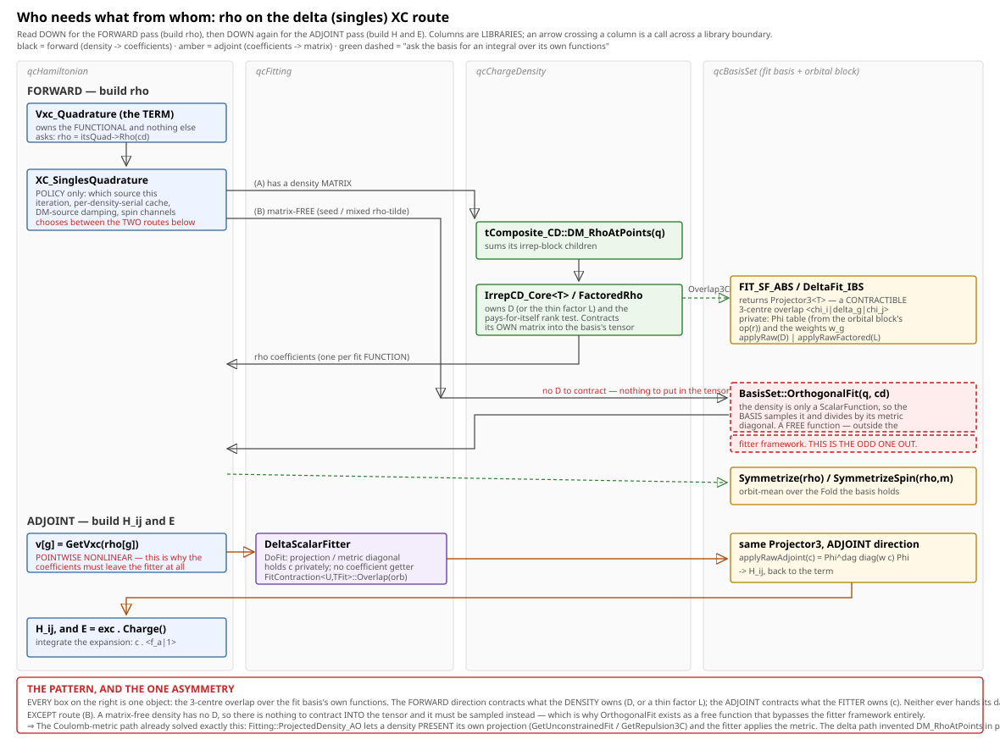

# Open Work — HISTORY 2 (closed threads, cut 2026-08-25)

Closed work moved out of `doc/OpenWork.md` so the tracker holds only what is in flight.  This is the
2026-08-21 → 2026-08-24 arc: the Vxc repair thread, and the three-part fit-basis interface refactor that
grew out of it.  Everything here is DONE and verified; nothing here needs doing.  (`OpenWork_History1.md`
holds the earlier cut — threads A–E and runtime rounds 1–4.)

**What is in here, and why you might come looking:**
- **THE Vxc REPAIR (built, measured, OPT-IN)** — routes (a)/(b)/(c) for feeding XC the DM ρ, the α_eff
  damping rule, the Kerker residual spectrum, and the GDM canary.  ⚠ Its two live consequences were LIFTED
  into the tracker's Step 3 runtime item rather than left here: route (b) is MORE accurate (not neutral),
  and Step 5's term-by-term CP2K comparison must PIN the flag first.
- **SEPARATION OF CONCERNS IN THE XC TERMS** — the design item and its four steps plus the absorption:
  one term set, two strategies (pair/singles), `PWFittedVxc` retired.
- **THE FITTING BOUNDARY** — `TFit`/`U` keying, qcFitting speaking `Orbital_DFT_IBS&`, `FitOperations`,
  `Symmetrize`/`SymmetrizeSpin` off the fit face.
- **ONE FIT-BASIS INTERFACE** — the δ basis made Liskov-substitutable with the Gaussian one.

The durable rulings from all of it live in `doc/CleanupCandidates.md` R1.0, not here.

---

### ✅ SESSION RESULTS 2026-08-21/22 — THE Vxc REPAIR IS BUILT, MEASURED, AND OPT-IN

**⛔ FIRST, TWO CLAIMS BELOW ARE NOW WRONG AND ARE CORRECTED HERE.**
1. *"at the fixed point ρ[D]=ρ_mix, so the converged answer is unchanged"* (route (b)) — **NO.**  ρ̃ is a
   band-limited FIT PROJECTION, so ρ̃_mix(r) ≠ ρ[D](r) pointwise even at convergence; the two have DIFFERENT
   fixed points.  MEASURED: NaF **139 μHa**, MnO individual terms **~100–150 mHa** (Ekin +110, Een −148) while
   the TOTAL moves 8 μHa — the variational signature.  Route (b) is therefore MORE ACCURATE, not neutral.
   ⚠ Consequence for **Step 5**: its term-by-term breakdown vs CP2K moves by ~100 mHa with this flag, so the
   flag must be PINNED before that comparison means anything.  (It does NOT explain the ~100 mHa offset —
   the total barely moves.)
2. The cost framing predating CALL COUNTS.  `report::Timed` now counts entries and prints `[xN, s/call]`.

**THE MEASUREMENTS** (MnO AFM-II imposed, 41 it, 97160 Becke points, n=122, r=17):

| bucket | calls | s/call | total | share |
|---|---|---|---|---|
| XC-mesh ρ sampling (matrix-free ρ̃) | 42 | **5.19** | **218.0 s** | **51%** |
| collocate density (pair scatter) | 330 | 0.105 | 34.7 s | 8% |
| XC-mesh quadrature H_xc | 168 | 0.175 | 29.4 s | 7% |
| integrate-back (pair gather) | 166 | 0.116 | 19.2 s | 5% |
| XC-mesh ρ sampling (DM GEMM, low-rank) | 41 | **0.042** | 1.7 s | 0.4% |
| (same, full-rank) | 41 | 0.296 | 12.1 s | — |

**⇒ the ρ̃ sampling was THE largest cost in the run, and the DM route is ~124× cheaper per sampling.**
Low-rank on the GEMM: **7.05×**, against the predicted n/r = 122/17 = 7.2.

**★ AND IT IS AN ACCURACY FIX, NOT ONLY A SPEED ONE.**  `GPW_RHO_NEGATIVE=1` census:

| route | points with ρ<0 (of 97160) | negative mass | min ρ |
|---|---|---|---|
| matrix-free ρ̃ | **8.5–18%, every iteration, persistent to convergence** | −0.003…−0.007 e | **−0.147** |
| DM / DM-source | **0**, over 200+ samplings and 2 cells | 0 | 0 |

A truncated Fourier series RINGS NEGATIVE at the cusps — and `SlaterExchange::GetVxc` guards `if (ro>0)` and
returns 0, so up to a fifth of the atom-centred quadrature contributed NOTHING to v_xc/E_xc, silently.
ρ=‖L†Φ‖² cannot do that.

**BUILT (all opt-in; default path byte-identical, suite 756/756):**
- `FactoredRho<Leaf>` — derived leaf, memoized per density serial, Tr(D) re-check against a stale memo.
  `IrrepCD_Factory(..., RhoRoute)`; `EigenTrim` throws (Cholesky's pivots ARE the spectrum).
  ⚠ The memo is the point as much as the GEMM: `LowRankFactor` used to run an O(n³) `pstrf` on EVERY call.
- `tDM_Sourced_CD` — the mixer retains the D its field was built from (SHARED ownership; aliasing
  `shared_ptr` for the polarized split) + **`EffectiveAlpha()`**.  `GPW_XC_DM_SOURCE=1`.
- Instruments: `Timed` call counts, `GPW_RHO_NEGATIVE`, `GPW_KERKER_SPECTRUM`, α_eff in the ρ_mix trace
  column (`Ker 0.45>0.33`), `GPW_XC_DM_BOOST`.

### ★★ α_eff — READ THE DAMPING OFF THE MIX INSTEAD OF SETTING IT

**The defect first:** route (b) as first wired fed XC ρ[D_out] UNDAMPED while Hartree kept Kerker's α·f(G) —
a HALF-DAMPED map.  NaF DIIS went 34 → 100+ iterations.  That is NOT evidence that ρ̃ is a better XC input
(user's challenge, and it was right); it is a wiring error.  Restoring damping fixes it.

\f[ \alpha_{\rm eff}=\frac{\lVert\tilde\rho_{mix}-\tilde\rho_{in}\rVert_2}{\lVert\tilde\rho_{out}-\tilde\rho_{in}\rVert_2}
   = \alpha\sqrt{\frac{\sum_G f(G)^2|\delta\tilde\rho|^2}{\sum_G|\delta\tilde\rho|^2}} \f]

— α times the residual-power-weighted RMS of the filter.  **MEASURED, not modelled**: two accumulators in the
loop `KerkerMix` already runs, so it needs no knowledge of WHICH preconditioner ran (exact for Kerker, = α
for a linear mix, may EXCEED 1 for Pulay — extrapolation overshoots on purpose).  Deposited on the field, so
the XC channel matches the damping without a SECOND independently-settable mixing policy.

| NaF stage 1 (DIIS) | baseline | undamped | flat α=0.25 | **α_eff** |
|---|---|---|---|---|
| iterations | 34 | **100+, FAILED** | 55 | **43** |

α_eff BEATS the hand-set flat value.  Converged energies are damping-INDEPENDENT (2e-8 across α) while
sitting 139 μHa from baseline — path vs fixed point, cleanly separated.

**THE BOOST (`GPW_XC_DM_BOOST`, default 1) IS JUSTIFIED AND IS NOT A DUPLICATE OF α.**

| iterations | baseline | undamped | α_eff ×1 | **α_eff ×2** |
|---|---|---|---|---|
| MnO | 41 | 46 | 53 | **39** (208.7 s vs baseline 425 s = **2.04×**) |
| NaF | 34 | 100+ | 43 | 47 |

No universal multiplier — MnO wants 2, NaF wants 1.  **Raising α instead does NOT work**: MnO at α=0.9
OSCILLATES with AND without the DM route (E=−45.2, 80 it), i.e. HARTREE has no headroom at 0.9 while XC ran
happily at 0.71.  α moves both channels; the boost moves only XC, which is the whole point — Kerker's
low-G damping is medicine for the 4π/G² divergence that XC's finite kernel never had.

### ★★ THE RESIDUAL SPECTRUM (`GPW_KERKER_SPECTRUM=1`) — AND AN MnO CONVERGENCE FINDING

Binned in x=G/G₀ (the filter's own argument, so cells compare):

| | 0.5–1 (f≈0.30) | 1–2 (f≈0.64) | 2–3 (f≈0.84) | 3–5 (f≈0.93) |
|---|---|---|---|---|
| **NaF**, iter 1 | **0.0%** | 21.6% | 43.5% | 31.9% |
| **NaF**, final | **0.0%** | 47.1% | 47.4% | 3.6% |
| **MnO**, iter 1 | 3.8% | 60.0% | 24.5% | 8.0% |
| **MnO**, final | **75.4%** | 17.5% | 5.2% | 1.5% |

**NaF's residual has NO power below x=1, ever** — Kerker barely filters it, so α_eff≈0.8α is a faithful
summary and there is nothing for a boost to recover.  **MnO's residual MIGRATES DOWN**: by the end 75% sits
where f=0.30, dragging α_eff 0.35 → 0.197.  That is exactly why ×2 helps MnO and not NaF — one mechanism,
both cells, visible in the data.
**★ INDEPENDENT OF THIS TRACK: late MnO convergence is rate-limited by the |G|≈0.65 CHARGE mode damped to an
effective 0.45×0.30 = 0.135.**  `GPW_SCF_UT.C` predicted that arithmetic; this measures which mode dominates,
which turns the `MNO_KERKER_G0` sweep from "a PREDICTION to be swept" into a measurement.

### ✅ GDM AT kT=0 IS UNAFFECTED (user's canary)

Inside the geodesic the Fock comes from `itsCD` and every line-search energy from `GetTotalEnergy(cdt)`, both
D-backed — so route (b)'s branch (which needs a density with NO DM face) cannot fire.  MEASURED on the NaF
stage-2 GDM: 9 it (α_eff) / 8 it (undamped) / 25 it (baseline), **zero** convention-shift events, no
line-search pathology.  It also REMOVES a discontinuity: mixed steps used to feed XC ringing ρ̃ while geodesic
steps fed exact ρ[D]; now both feed ρ[D].

### ★★★ MESH ⊥ ρ-ROUTE — AND THE MISSING CELL WAS NEVER MISSING (user, 2026-08-22)

ρ for XC has two INDEPENDENT axes: WHICH POINTS (uniform / Becke) and HOW ρ is produced (PAIR collocation /
SINGLES Φ-table, optionally factored).  `GpwOptions::vxcFit` and `xcMesh.cellKind` ALREADY express exactly
that (§6a fit/grid separation), and `VxcFit::Delta + UnitCellKind::Uniform` is supported, documented and
prints `[XC quadrature] DELTA fit on the uniform cell mesh`.  It had simply never been RUN — `Auto` gives the
historical pairing (PW on uniform, Delta on Becke).  PW+Becke is impossible (no G raster); polarized forces
Delta.  **Si Γ, Delta+Uniform, `SI_VXCFIT_DELTA=1`:**

| | lowrank=1 | lowrank=0 |
|---|---|---|
| U-4x | −7.115059004, **11 it CONVERGED** | −7.115059004, **11 it CONVERGED** |
| U-sel | −7.114980442, 60 it (degenerate manifold, benign) | −7.114980442, 60 it |

**BIT-IDENTICAL** — the clean exactness test, third material, uniform grid.  U-4x also beats the `Auto`
baseline (11 vs 14 it).  Si rank: **r=4–12 of n=24** (r=4 = its 4 occupied pairs), so low rank now holds on
ionic-magnetic AND covalent.  Low-rank speedup on ρ 1.26× at n=24 and H_xc UNCHANGED — the fourth
confirmation that **the rank helps the density side and never the operator side**.

⚠ **A FAILED ATTEMPT WORTH RECORDING (and its lesson).**  Before finding the above I added a `GPW_XC_SINGLES`
flag sourcing ρ from a Φ GEMM inside `PWFittedVxc` while leaving H_xc on the screened pair gather.  Si went
14 → 60 iterations and the energy moved 35 μHa.  **Vxc and Exc must reach D by ONE discrete path** (the
`GPW.RawXCConsistencyFD` gate is what enforces it); ρ from an unscreened GEMM paired with a screened adjoint
is two functionals.  `XC_SinglesQuadrature` owns ρ AND its quadrature over one Φ table, making the mismatch
unrepresentable; `PWFittedVxc` splits those owners, which is what permitted the bug.  Reverted.

### ★★★ DESIGN ITEM — SEPARATION OF CONCERNS IN THE XC TERMS (user, 2026-08-22)

**The ask:** `fit basis {Delta,PW,aux} x quad grid {Uniform,Becke} x op assembly {pair,singles} x
functional {LDA,GGA,hybrid}` should be freely combinable — *"the software should not hard code certain
combos and not others"* — **and every combination must be variational, so GDM just works.**  What follows is
what a day of measuring says the axes actually are; the short version is that one of the four is not an axis,
one coupling is mathematical and must be made structural, and one of our two XC terms is misnamed.

**1. ⛔ THE `PWFittedVxc` NAME IS A LIE ON THE PRODUCTION PATH.**  Since 0.5(f2) the RAW branch is the
default and it performs **no plane-wave fit at all** — the code's own comment says *"No ball fit anywhere"*.
It evaluates \f$v_{xc}\f$ pointwise on the fit raster and assembles H through `applyRawAdjoint`.  So it is a
**δ-basis quadrature**, exactly like `DeltaFittedVxc`; `VxcFit::PlaneWave` names a route it does not take.
(Discovered the hard way: a `GPW_FIELD_SPECTRUM` census of the fit coefficients printed nothing, because the
coefficients are never computed.)  The genuinely-fitted BALL branch survives only as a dormant fallback.

**2. AXIS C (pair vs singles) IS AN ALGORITHM, NOT A SEMANTICS.**  On the SAME points both compute
\f[ H_{ij}=\sum_g w_g\,v(r_g)\,\chi_i(r_g)\chi_j(r_g) \f]
— the pair route materialises \f$\chi_i\chi_j\f$ into multigrid boxes, the singles route contracts through
Φ.  Same formula, different evaluation order; they differ ONLY through the pair route's ε-screening and
multigrid truncation.  So it is a COST/TRUNCATION strategy, not a user-facing choice.
**⚠ But it is not a free choice either, and neither route always wins** (user's question): the pair cost
scales with the SCREENED pair count and wins where screening bites (large cells, diffuse bases); the singles
GEMM wins where n is small against npts or screening is weak — MnO's 4-atom cell measured a Φ-sparsity
ceiling of only ~2×, i.e. screening barely helps there.  So it is a **crossover**, and the right shape is the
one `UnitCellKind::Auto` already uses: an automatic selector with an explicit override, **latched for the
run** (switching mid-SCF changes the truncated operator, i.e. the functional — the same hazard the RAW/BALL
latch exists for).

**3. ★ THE ONE MATHEMATICAL COUPLING: the ρ-route and the H-route MUST BE ADJOINT.**  \f$H=\partial
E/\partial D\f$ holds only if the integrate-back is the EXACT adjoint of the collocation *on the same
truncated operator* — what `GPW.RawXCConsistencyFD` gates.  So these are **not two axes; they are one object
with two faces.**  `XC_SinglesQuadrature` already is that (`Rho()` and `Matrix()` over one Φ).  `PWFittedVxc` splits
them across two owners, which is exactly why a mismatch was expressible there — MEASURED 2026-08-22:
unscreened singles ρ + screened pair H sent Si from 14 to 60 iterations and moved E by 35 μHa.

**4. A FITTED REPRESENTATION IS VARIATIONAL IFF E IS DEFINED THROUGH THE FIT.**  \f$H_{ij}=\sum_k c_k\langle
c_k|\chi_i\chi_j\rangle\f$ is fine — with c the STATIONARY point of the least-squares fit in the metric that
also defines E (the robust/Dunlap form), the \f$dc/dD\f$ terms vanish and H is exactly \f$\partial
E/\partial D\f$.  This is standard in molecular DFT.  Today's BALL route is non-variational because E comes
from grid quadrature while H comes from the fit — TWO DEFINITIONS OF ONE ENERGY, not a defect of fitting.

**⇒ THE REAL AXES ARE THREE, AND THEY COMMUTE:**

| axis | what it is |
|---|---|
| **Quadrature** | points + weights + the adjoint-paired ρ/H routes; pair-vs-singles is INTERNAL strategy |
| **Vxc representation** | δ (identity) · PW · Gaussian aux — fitted ones use the ROBUST form |
| **Functional** | LDA · GGA · hybrid (already abstract: `ExFunctional`) |

**⇒ THE ABSORPTION.**  `PWFittedVxc`'s production behaviour IS `DeltaFittedVxc` over a raster-backed mesh
with the pair strategy.  Its points are already expressible (wrap `G_Quadrature::GridPoints()` with weight
Ω/N).  So:
- `XC_SinglesQuadrature` gains the strategy — same two faces, internally Φ-backed (singles) or 3C-tensor-backed
  (pair).  ⚠ One structural wrinkle: the pair strategy needs `Overlap3C(*fitBasis)`'s
  `applyRaw`/`applyRawAdjoint`, so a pair-strategy engine takes the FIT BASIS where a singles engine takes
  only the mesh.  Different ctors, same faces.
- The quadrature XC term (today's `DeltaFittedVxc`, itself misnamed — its "fit basis" is the identity)
  becomes THE term.  `PWFittedVxc` has nothing left on the production path.
- What remains of it is the BALL branch — and THAT is what deserves the "Fitted" name, rebuilt in the robust
  form.  `itsRhoIsRaw`'s latch, the BALL fallback and the real-TRIM throw re-home there.
- `VxcFit` then selects REPRESENTATION (identity vs fitted), not secretly the grid AND the assembly.

**⇒ AND "GDM JUST WORKS" BECOMES STRUCTURAL**, resting on exactly two things: ρ and H from one adjoint-paired
object (a mismatch becomes unrepresentable), and any fit defined in the robust form.  The FD gate then
becomes a test PARAMETERISED OVER ALL COMBINATIONS, so a new one cannot ship non-variational.

**THE CELLS THAT ARE UNREACHABLE TODAY — and note two of them need no Becke mesh at all.**  "Uniform" is TWO
point sets in this code: the fit raster (corners \f$i/N\f$, N from the fit G-ball) and
`UnitCell::CreateIntegrationMesh` (midpoints \f$(i+\frac12)/n\f$).  Each is welded to ONE assembly:

| points | pair | singles |
|---|---|---|
| fit raster (corners) | ✅ `PWFittedVxc` | ❌ |
| UnitCell mesh (midpoints) | ❌ | ✅ Delta+Uniform |
| Becke | ❌ (no box structure to gather into — the genuinely hard one) | ✅ Delta+Becke |

**MEASURED INPUTS ALREADY IN HAND.**  `VxcFit::Delta + UnitCellKind::Uniform` is supported, documented (§6a
fit/grid separation) and had simply never been RUN — Si there is BIT-IDENTICAL under factoring and converges
11 vs 14 iterations.  `GPW_MESH_ORTHO=M` measures \f$T(\Delta G)=\sum_g w_g e^{i\Delta G\cdot r_g}\f$, the
whole non-orthogonality of a PW basis under a mesh: uniform ~1e-15 (exact), Becke 1e-3 rising to 2.6e-2 by
\f$|\Delta G|>6\f$, and L=29→35 improves the high-\f$|\Delta G|\f$ end 2.7× and the low end not at all —
the angular rule running out.  So a PW fit on Becke is WELL CONDITIONED where it matters.  ⚠ And the fit
basis is built at `relCutoff * {G}_rho` with `GridCutoffFactor()` = 1.0 for every functional, so v_xc uses
the FULL density ball (24k G on MnO) — never swept below 1.  At 1/3 the radius that is ~900 vectors and the
metric solve becomes trivial; the honest way to pick it is E_xc convergence, not a rule of thumb.

**⇒ THE MECHANISM: `CreateVxcFitBasisSet` MAKES ALL THE DECISIONS, AND KEEPS ITS NAME (user, 2026-08-22).**
The basis already has TWO factories with the SAME inputs returning different halves of one answer --
`CreateVxcFitBasisSet(st,mp)` and `CreateXCQuadrature(st,mp)` (the latter already a BUNDLE:
`{mesh, fold, sigmas, flipFixed}`).  `Ham_PW_DFT::BuildTerms` then re-decides on `becke`/`polarized`/`delta`
and picks a TERM CLASS -- which is where the combinations get hard-coded.  Fix: the quadrature is ABSORBED
into the fit basis and `BuildTerms` stops switching, because **under the weight-vector view a fit basis is
not defined without points** (\f$W_c[g]=w_g c^*(r_g)\f$), so the mesh is CONSTITUTIVE of the basis, not a
sibling of it.  `PlaneWaveFit_IBS` already works this way (it IS a `G_Quadrature`).
- ⚠ NOT an "XCEngine" (user): *"Engine just means something that does some work, so it adds no info"* --
  and `XC_SinglesQuadrature` is already an instance of that non-name.  The factory keeps its name and its job.
- **The δ case stops being a null-object smell.**  The 2026-08-01 objection was to a ZERO-FUNCTION
  pseudo-basis; a **delta basis** is a different object -- n_pts genuine δ functions, exact on that point
  set, metric DIAGONAL (\f$\langle\delta_g|\delta_{g'}\rangle=w_g\delta_{gg'}\f$), fit = identity.  Under
  the old framing there was nothing to represent; under "a fit basis is a family of weight vectors" it is the
  most natural basis there is, and the doc's *quadrature is the δ-basis special case of fitting* becomes a
  TYPE instead of an analogy.
- **The assembly strategy needs NO extra input**: both routes are already functions of (orbital basis, fit
  basis) -- pair is `orb.Overlap3C(*fitBasis).applyRawAdjoint`, singles is Φ at the fit basis's points.
  Capability decides what is POSSIBLE, policy (beside `ResolveXCMesh`) decides which.

**⇒ THE ACTUAL CHANGE SET IS SMALL AND LOCAL -- `FIT_SF_ABS<T>` NEEDS NO WIDENING.**  ⛔ (I first claimed a
five-basis blast radius; wrong.)  That face is thin (`isOrtho` + `SymmetrizeRaster`) and the quadrature is
already reached by CAPABILITY CROSS-CAST, not through it (`OrthoScalarFitter::FitGrid()` casts to
`G_Quadrature`).  So the molecular bases (Atom, SymmetryAdapted, the generic default) are untouched.  What
actually blocks the missing cells is that **`G_Quadrature` BUNDLES two different things**:

| member | universal? |
|---|---|
| `GridPoints()`, `Integral(f)` | ✅ any point set / any weights |
| `RhoOnGrid`, `ForwardFFT`, `GridCoeff`, `FieldCoeffs` | ❌ **RASTER ONLY** |

A δ-basis-over-Becke can provide the first row and cannot provide the second, and today they are one face,
so it cannot answer at all.  **And the narrow face already exists: points+weights IS `qcMesh::Mesh`** (user's
standing guidance to use it as much as possible; NB its weights need not be quadrature weights -- they can
carry PW phases, which is what makes the weight-vector view a type and not a metaphor).  So:
1. split `G_Quadrature` → a `qcMesh::Mesh` accessor (universal) + the raster transform face (`PW_Grid_Evaluator`);
2. `OrthoScalarFitter::FitGrid()` splits the same way (points/Integral off the mesh, transforms off the raster);
3. a δ fit-basis type carrying a `qcMesh::Mesh`;
4. `CreateVxcFitBasisSet` picks basis + mesh; `CreateXCQuadrature`'s bundle folds into the returned basis.
⚠ One sizing trap: a δ basis has n_pts "functions", so anything reasoning about a fit basis by COUNTING
functions (grid sizing, memory reports, the `relCutoff` arithmetic) must not choke on 97160.

#### ✅ DONE 2026-08-22 — all four steps + THE ABSORPTION.  756/756; the two-route Si gate BIT-FOR-BIT

Steps 1–4 as written, then the absorption the section calls for (user: "also do the absorption").  What
landed, in the order it was built and tested:

| | |
|---|---|
| **1** | `G_Quadrature` → **`BasisSet::Quadrature`** (`Mesh()`, universal — new leaf module `qchem.BasisSet.Quadrature`) + **`G_RasterTransform`** (`RhoOnGrid`/`ForwardFFT`/`GridCoeff`/`FieldCoeffs`, honestly raster-only).  `PeriodicGridEvaluator` now STORES its raster as a `qcMesh::Mesh` (weights Ω/N) and `GridPoints()` reads it, so there is one copy, not two.  `qcMesh::Integrate(mesh,f)` added beside `SiteIntegrals`. |
| **2** | `GriddedScalarFitter::Grid()` → `Mesh()` + `Raster()`; `OrthoScalarFitter` cross-casts each half separately. |
| **3** | **`BasisSet::FIT_SF_Delta<T>`** (face) + **`DeltaFit_IBS`** (concrete, Bloch Γ) — the δ basis carries the `XCQuadrature` bundle (mesh + fold + σ tags), `Mesh()` from it, `isOrtho`, and `op(r)`/`Gradient` **throw** (user ruling: the value is a distribution and nothing wants it; `MakeOverlap` never appears because it lives on `FIT_SF_NonOrtho`, not on the face δ implements). |
| **4** | `VxcFit` moved DOWN into `qcMesh::MeshParams` (alias kept in `qchem::Hamiltonian`) so `CreateVxcFitBasisSet` can read it: ONE factory call returns δ-over-mesh or PW-over-raster.  `BuildTerms` resolves only `Auto` — the one decision that needs to know the run is polarized — and stamps it. |
| **absorption** | **`XC_Quadrature`** = the abstract two-faced object (ρ, and its exact adjoint H).  Two strategies: **`XC_SinglesQuadrature`** (ex `XC_SinglesQuadrature`, Φ table) and **`XC_PairQuadrature`** (ex `PWFittedVxc`'s guts — raw collocation + `applyRawAdjoint`, the BALL fallback, the R2.16 route latch).  `MakeXCQuadrature(fitBasis)` picks by CAPABILITY.  `PWFittedVxc` is GONE; `DeltaFittedVxc*` → **`Vxc_Quadrature` / `Vxc_QuadraturePol` / `Vcorr_QuadraturePol`**, one term set for every combination. |

**MEASURED, not asserted.**  `GPW_SCF.DeltaFitUniformGridMatchesPWFit_SiGamma` drives BOTH strategies
end-to-end; stashed/rebuilt/reran to compare against the pre-change binary:

| route | before | after | iters |
|---|---|---|---|
| Si PW-fit (now the PAIR quadrature) | −7.115067665 | **−7.115067665** | 11 → 11 |
| Si Delta uniform (now SINGLES) | −7.115059008 | **−7.115059008** | 11 → 11 |

Full sweep 756/756 (169 s), including the FD variational gates and the real/complex bitwise gate on the
pair route.  ⚠ One honest caveat: E_xc on the absorbed pair route is now accumulated as
`Σ (w·ε)·ρ` where it was `Σ w·(ε·ρ)` (the shared term body), and step 1 replaced the raster's
`(Σf)·Ω/N` with `Σ w_g f_g` — algebraically identical, last-digit different in principle; nothing
measurable moved at the 1e-9 the gate prints.

**FREE SIDE-EFFECT of the absorption:** the raw collocation now runs ONCE per iteration, not once per
TERM — the exchange and correlation terms share one `XC_Quadrature` the way the Becke pair always did.

**WHAT DID NOT CHANGE, deliberately.**  `CreateXCQuadrature` survives as the basis-side mesh BUILDER that
the whole-set `CreateVxcFitBasisSet` calls for the δ case (and that several tests drive directly); it is
simply no longer on the Hamiltonian's path — no caller re-decides anything.  The robust/Dunlap rebuild of
the genuinely-fitted BALL branch (item 4 above) is still open, as is PW-fit-on-Becke (I3) and the
pair-vs-singles auto-selector: capability picks the strategy today, so an override knob is the remaining piece.

#### REVIEW FIXES, same day (user, on reading the above)

**⛔ `VxcFit` DOES NOT BELONG IN qcMesh.**  It rode there as a `MeshParams` field so the factory could read
it — but `MeshParams` describes POINTS and `VxcFit` describes FUNCTIONS, which are *precisely the two axes
this whole section exists to separate*, so folding one into the other's parameter block re-welded them at
the type level while the code was busy unwelding them.  Moved to `qchem.BasisSet.Fit_IBS`, beside the
fit-basis types it selects between, and passed as its own ARGUMENT: `CreateVxcFitBasisSet(cl, mp, fit)`.
qcMesh is pure geometry again.

That argument sits on the WHOLE-SET `tBasisSet` factory only — the level the Hamiltonian actually asks at.
A Bloch BLOCK builds only its own lineage's fitted basis (the per-block δ branches are reverted), and
`DeltaFit_IBS` moved from qcLattice_BS up to qcBasisSet, since a δ basis over a mesh is not periodic-specific.
Molecular callers pass `Auto` — "give me your own representation" — and never interpret the other two;
`tBasisSet<double>` throws on an explicit `Delta`, because there is no real δ basis to build.

**⛔ `GriddedScalarFitter` HAD NO CONSUMERS — DELETED.**  Its whole purpose was "the XC term borrows the
grid THROUGH the fitter, one owner".  After the absorption the quadrature object holds the fit basis and
reads `BasisSet::Quadrature` directly, so `Raster()` had **zero** callers and `Mesh()` had one, redundant
with the caller's own.  A face nobody consumes is not an abstraction: `Factory(cFIT_SF_ABS)` now returns
plain `FunctionFitter_Scalar<dcmplx>`, and where the ortho fitter samples is its own business — exactly as
the AO fitter's Becke mesh is.

**⛔ `FIT_SF_Delta` DID NOT EARN ITS EXISTENCE — it does now.**  As first built its entire content was
`XCQuad()`: one getter, one consumer (`MakeXCQuadrature`), zero behaviour — a type whose only job was to
carry a struct across a cast, i.e. the 2026-08-01 null-object objection in a new costume (a basis with no
FUNCTIONS then, a basis with no BEHAVIOUR now).  **A fit basis is for DOING the fit and delivering E and
the H matrix, not for holding its functions — in the δ case its grid — and giving them away** (user).  So
the getter is gone and the face answers operations, every one of them over a field SAMPLED AT ITS OWN
POINTS, in its own order, so no caller learns where those points are or what kind of mesh they came from:

| | |
|---|---|
| `Integrate(f)` | \f$\int f=\sum_g w_g f_g\f$ — the E_xc quadrature |
| `SiteIntegrals(f)` | \f$\int w_A f\f$ per site block; EMPTY when the mesh has no atomic partition |
| `Sample(field)` | a field that evaluates itself anywhere, sampled at my points (matrix-free densities) |
| `Symmetrize(f)` | the orbit-mean projector; no-op on a free run, so the caller never asks whether symmetry was imposed |
| `SymmetrizeSpin(ρ,m)` | the Shubnikov (ρ even, m odd, flip-fixed zeros) projection — was a three-way branch in the consumer |

`XC_SinglesQuadrature` is now built ON that basis and keeps only POLICY (which source ρ comes from, the
per-serial caches, the spin channels, the DM-source damping).  The bundle's invariants and its `[fold]`
announcement moved into the basis ctor, where the object is made — providers self-report.

**⛔ AND "QUADRATURE" IS AN IMPLEMENTATION DETAIL, SO IT LEFT `BuildTerms`** (user).  The builder now says
*what the model is* and asks for XC terms: `MakeVxcTerms(exch, corr, XFitBasis, polarized)` returns the
pair, and the strategy choice, the sharing of one quadrature across the pair (ρ and the Φ tables built once
per ITERATION, not once per term), and the adjoint pairing are all inside.  The TERMS lost the mesh too:
they integrate through `XC_Quadrature::Integrate` and report through `NumPoints()`, so no term touches
weights or points.  `MakeXCQuadrature` picks by CAPABILITY — has the basis got `G_RasterTransform`? — never
by asking what the basis IS.

**WHAT IS LEFT, and where it lives.**  Exactly one coordinate escape survives: `Quadrature::Mesh()`, needed
because the ρ GEMM is initiated by the DENSITY (`cDM_CD::DM_RhoAtPoints`, which owns D and lives in a
library above qcBasisSet), so points and the Φ cache must still reach it.  It is confined to the two
`XC_*Quadrature` strategies — no term, no Hamiltonian, no fit-basis client sees it — and closing it means
flipping `DM_RhoAtPoints` to take the δ basis and ask it per block, which brings Φ and BOTH contractions
into the basis and touches qcChargeDensity's IrrepCD/composite tree.  That is the only piece of this design
item still outstanding; everything else about δ-vs-fitted and pair-vs-singles is settled.

⇒ **AND IT IS NOT ITS OWN ITEM: it closes as an instance of `doc/CleanupCandidates.md` R1.0** (the "FAKE
RADIAL `op(r)`" cure — *consumers stop touching `op(r)`; code that wants an INTEGRAL asks the basis for
it*).  Φ_gi = ⟨δ_g|χ_i⟩/w_g is a cross-basis overlap, so the same discipline that fixes the atomic fake
radial turns `DM_RhoAtPoints(points, tables)` into `DM_RhoAtPoints(basis)`.  R1.0 now carries the scope
(step (1) only — step (2), honest Y_lm `op(r)`, is explicitly out, user 2026-08-22), the enabling move
(`VectorFunction<T>` off `IrrepBasisSet<T>`, onto `Orbital_1E_IBS<T>` — four pointwise sites, three of
them orbital), and the naming trap (a δ basis's `Sample` is the FIT coefficient vector, NOT
`MakeOverlap`, since ⟨δ_g|f⟩ = w_g f(r_g)).

Re-verified after all three: 756/756, and the two-route Si gate still prints −7.115067665 / −7.115059008 at 11/11 iterations.

---

## ★★★ THE FITTING BOUNDARY — SPECCED 2026-08-24, ✅ BUILT THE SAME DAY (the spec follows, annotated)

#### ✅ WHAT LANDED: items 0, 1, 3 and half of 2, as three commits.  758/758 after each; the pinned Si
#### two-route gate bit-unmoved at −7.115067665 / −7.115059008, 11/11 iterations, after each.

| item | commit | outcome |
|---|---|---|
| **0** `TFit`/`U` keying | increment 8 | `FitContraction<U>` → `FitContraction<U,TFit>` — the mirror of `Integrals_Overlap3C`, no default for `TFit` on either.  `DeltaScalarFitter` declares `<double,dcmplx>` + `<dcmplx,dcmplx>`: the 3c-3 mixed run, finally spelled |
| **1** qcFitting speaks `Orbital_DFT_IBS` | increment 8 | same commit, because it is one change to one signature.  THREE casts deleted; the survivors moved up into `XC_*Quadrature::MatrixT`.  The molecular terms needed no new cast at all — `FittedVxc`/`FittedVcorrPol` already held `odftbs_t` and were widening it back to the 1E base to make the call |
| **3** `Symmetrize`/`SymmetrizeSpin` | increment 9 | gone from `FIT_SF_ABS`.  δ's fold+tags INJECTED (the factory out-parameter widened from the mesh to the whole `FitQuadrature` — they are its sibling fields); the plane-wave voxel/FFT version went to `G_RasterTransform`.  The fit face now has **no operation on it that needs a mesh** |
| **2a** `Overlap3CFace` | increment 10 | deleted; three call sites spell their own cast |
| **2b** `OrthogonalFit` | increment 10 | MOVED to qcFitting (`qchem.Fitting.FitOperations`); qcBasisSet loses the module.  ⚠ **the bypass itself is NOT fixed — see the ruling wanted below** |

**Two things worth carrying forward:**
- **The MnO Shubnikov gate caught increment 9's omission on the first run** — a probe that built the basis
  over one quadrature and the strategy over another failed loudly.  That is injection working as intended,
  and the fix (`SinglesEngineOver`, one bundle to both collaborators) is what the production factory does.
- **`if constexpr` did not earn its keep in `Overlap3CFace`**: after the face carried both axes, the
  same-scalar arm was a derived-to-virtual-base cast that cannot fail, at call sites that run once per Fock
  block.  A compile-time branch is still worth writing only where the run-time one could actually be wrong
  or hot.

#### ✅ AND THE ONE THING LEFT WAS RULED AND BUILT (user, 2026-08-24) — increments R1.0c + 11

*"DeltaScalarFitter needs to hold a shallow copy of \f$\Phi_{gi}=\chi_i(r_g)\f$."*  It needed no new
machinery: **`Projector3` already IS that shallow copy** (three closures over the basis's address-stable
table, ~100 bytes against tens of MB), and the **fitter has RUN lifetime** where the density does not — a
fresh density object is built every iteration (`SCFIterator.C:343`), which is why a density-side Φ cache
was never available.  New face `Fitting::ScalarProjector`; `tDM_CD::DM_RhoAtPoints` takes it instead of the
fit basis; **`OrthogonalFit` is down to two callers, both inside qcFitting — no client bypass remains.**

And the coefficient question **dissolved rather than being solved**: a PROJECTION returns coefficients, a
FIT stores them, and ρ only ever needed the first.  So no `Coefficients()` getter is needed anywhere, and
the "expansion type" sketched below is parked unless something else asks for it.

⚠ **THE SESSION'S REAL FIND, though, was the gate that had to land first (R2.21).**  `blaze::conj`
conjugates a matrix or a vector but is the **identity on a complex SCALAR** — so `blazem::conj(M(i,j))`
compiles, reads correctly, and does nothing.  `LowRankFactor` built \f$L=PU^T\f$ instead of
\f$PU^\dagger\f$, giving \f$LL^\dagger=D^T\f$ and a ρ wrong by ~1e-1 relative on any block with
genuinely complex Φ.  Live production code (`QCHEM_DM_LOWRANK` defaults on), invisible for two compounding
reasons: no enabled test exercised the factored complex path, and the PSD guard checks
\f$\mathrm{Tr}(LL^\dagger)\f$ through \f$|L|^2\f$, which a conjugation error does not move.

⇒ **Carry this one forward: a complex TYPE is not a complex VALUE.**  Every k on a 2×2×2 mesh is TRIM, so
the pre-existing "complex" rig held REAL Φ in a complex matrix and could not have caught this whatever it
asserted.  A gate meant to exercise complex arithmetic must be built at a geometry where the numbers are
actually complex, and must say so.

---

#### The ruling as it stood before that (R1.0g in doc/CleanupCandidates.md)

The user's sentence had two halves and only the first is done.  *"OrthogonalFit belongs in the qcFitting
library"* — done.  *"Client code needs to use that framework, not dodge around it"* — **not** done: two
callers still use the algorithm INSTEAD of a `FunctionFitter_Scalar` (`XC_SinglesQuadrature`'s matrix-free
branches, and `tDM_CD::DM_RhoAtPoints`'s default).  Both want the COEFFICIENT VECTOR, and the fitter face
has no accessor for one — adding `Coefficients()` is exactly the smell deleted in increment 6.

The spec's own ⚠ already concedes the coefficients must reach the term regardless (\f$v_{xc}\f$ is
pointwise nonlinear; for δ they ARE \f$\rho(r_g)\f$), so **the question is what TYPE carries them, and
that is a design ruling, not a refactor.**  The shape of the answer is visible in the tree: the object
would be *an EXPANSION over a fit basis* — `Integrate()` = \f$c\cdot\langle f_a|1\rangle\f$,
`Map(functional)`, `Contract(orb)`.  That is precisely what `XC_Quadrature` and `FunctionFitter_Scalar`
jointly are today, split across two objects with the coefficient array passed between them as a raw
`rvec_t`.  Introducing it reshapes the term/quadrature/fitter triangle — which is why it is not being
done on my own initiative.

---

### The spec as written (user, 2026-08-24)

Four items the user set, plus the keying work they all lean on.  **Suggested order is 0 → 3 → 1 → 2**, and
the reason is at the bottom.  (Built as 0+1 together, then 3, then 2 — 0 and 1 turned out to be one edit to
one signature, and doing them apart would have meant touching every `FitContraction` site twice.)

### 0. FIRST, because FOUR separate items now pay for it: the `TFit`/`U` keying (RealComplexPlan 3c-3)

An orbital block carries TWO scalars — its own (`U`) and the fit axis it was built on (`TFit`) — and they
differ exactly once, but that once is production: `tGPW_IBS<double>` IS-A `Orbital_DFT_IBS<double,dcmplx>`,
the real TRIM block.  Everything below trips over it:

| item | how it trips |
|---|---|
| `FitContraction<U>` (item 1) | must become `<U,TFit>`, same as `Integrals_Overlap3C` already did |
| making `Orbital_DFT_IBS::Overlap3C` non-public | `XC_PairQuadrature` needs `Projector3<dcmplx>` for a possibly-REAL block — a combination the fit-side face (keyed by the orbital scalar) cannot express, so the pair route cannot be moved off the orbital-side entry |
| `orb.Overlap3C(deltaBasis)` still compiling | same blocker |
| the third `Integrals_Overlap3C` combination | ditto |

Do it once, deliberately, rather than four times by accident.

### 1. qcFitting should speak `Orbital_DFT_IBS&`, not `Orbital_1E_IBS&` (user)

`FitContraction<U>::Overlap(const robs_t<U>*)` is the last fitter face taking the 1E base.  It becomes
`FitContraction<U,TFit>` over `Orbital_DFT_IBS<U,TFit>`, exactly as `Integrals_Overlap3C` did in increment 7.
The cast then moves up into `XC_SinglesQuadrature::MatrixT` / `XC_PairQuadrature::MatrixT` — **which is the
right place**: the generic term machinery (`cDynamic_HT::MakeMatrix(const cobs_t*)`) is deliberately
method-neutral and a Kinetic term must not see DFT types, whereas an XC strategy is DFT-specific by
construction.  So the DFT assumption ends up stated where it actually lives.

### 2. `src/BasisSet/FitOperations.C` should go (user) — but its two halves die differently

- **`Overlap3CFace` — just delete it.**  Since the parameter became the DFT face it is an `if constexpr`
  saving two lines at two call sites.  Inline at both; the file's second reason to exist evaporates.
- **`OrthogonalFit` — the principle is right, the destination needs the diagram below.**  User: *"OrthogonalFit
  belongs in the qcFitting library.  Client code needs to use that framework, not dodge around it."*  Agreed
  that a free function client code calls INSTEAD of the fitter is a bypass.  What blocks a straight move is
  that `FunctionFitter_Scalar` deliberately has **no coefficient accessor** (`DoFit` / `ReScale` / `Write` /
  `FitContraction::Overlap`), while the caller — `tDM_CD::DM_RhoAtPoints` — wants precisely the coefficient
  vector.  Adding a `Coefficients()` getter would be the same smell deleted in increment 6.

#### The data flow, because the question is really "who needs what from whom"

**The pattern IS clean, and the diagram shows it.**  Every basis-side box is ONE object: the 3-centre
overlap over the fit basis's own functions.  The FORWARD direction contracts what the DENSITY owns
(\f$D\f$, or the thin factor \f$L\f$); the ADJOINT contracts what the FITTER owns (\f$c\f$).  Neither
side hands its data out — the integral is what crosses.

**One box breaks the pattern**, and it is exactly `OrthogonalFit`: a MATRIX-FREE density (the seed, or a
\f$\tilde\rho\f$-mixed density) has no \f$D\f$, so there is nothing to contract into the tensor and it
must be SAMPLED instead.  That is why the bypass exists — not carelessness, an absent operand.

⇒ **AND THE CURE ALREADY EXISTS IN THE TREE, on the other metric.**  The Coulomb-metric path solved this
years-equivalent ago: `Fitting::ProjectedDensity_AO` lets a density PRESENT its own projection
(`GetUnconstrainedFit` / `GetRepulsion3C`, the strategy chosen by which face it derives) and the FITTER
applies the metric and the charge constraint.  The \f$\delta\f$/XC path invented `DM_RhoAtPoints` in
parallel instead of reusing that shape.  So the target is a `ProjectedScalar`-style presentation: a
matrix-backed density offers the tensor contraction, a matrix-free one offers itself as a field, and the
fitter applies the metric either way.  `OrthogonalFit` then IS the fitter's metric step, in qcFitting, and
no client dodges anything.
⚠ **The one thing that does NOT dissolve**, and it should be stated rather than designed around:
\f$v_{xc}\f$ is POINTWISE NONLINEAR, so the coefficients genuinely must reach the term — for \f$\delta\f$
they are \f$\rho(r_g)\f$ and the functional is applied to them directly.  That is forced by the physics,
not by the interface.  The open question is therefore not *how do we hide the coefficients* but *what type
should carry them*; a bare `rvec_t` from `DM_RhoAtPoints` is the weakest possible answer.

### 3. `FIT_SF_ABS::Symmetrize` / `SymmetrizeSpin` should go (user) — and there is a clean exit

User: *"these look like functions that need access to Fit_IBS's internal (none of your business) integration
mesh.  They do not belong in a fit basis set interface."*  Agreed, and both are already thin:
- **δ**: `Symmetrize` is ONE line over `Symmetry::Lattice_3D::SymmetrizeValues(fold, vals)` and
  `SymmetrizeSpin` is that plus the signed variant — free functions that already exist.  All the basis
  contributes is the `Fold`.  **Inject the `Fold` exactly as increment 6 injected the mesh** (it is the
  sibling field of the same `FitQuadrature`), and both overrides vanish with the caller using the free
  functions directly.
- **plane wave**: genuinely different — a voxel permutation plus an FFT shift-theorem glide, which needs the
  raster.  That belongs on `G_RasterTransform`, where every other raster-only operation already went.

Do both and `FIT_SF_ABS` loses both members outright — the same cure as `SiteIntegrals`, for the same
reason: the operation was never a fitting question, the basis was merely the only object holding the
geometry.

### Why this order

3 is smallest and independent — do it first and `FIT_SF_ABS` is down to the four integrals.  1 needs 0.
2's `Overlap3CFace` half is free once 1 lands; 2's `OrthogonalFit` half should go LAST, because by then it
will be clear whether the retyped fitter face can absorb the projection presentation without a coefficient
getter.  ⚠ 1 and 3 both touch `XC_SinglesQuadrature`, and 2 touches `DM_RhoAtPoints`, which 1's cast also
passes through — so they are not independent enough to parallelise across sessions.

---

## ★★★ ONE FIT-BASIS INTERFACE (user, 2026-08-22) — ✅ DONE 2026-08-23 (the spec follows, annotated)

#### ✅ WHAT LANDED.  758/758 (count UP by one gate, not down); Si two-route gate BIT-UNMOVED at 11/11.

`FIT_SF_ABS<T>` lost `NumPoints` / `Sample(f)` / `Integrate(values)` and gained the two integrals every
fit basis can answer **per FUNCTION** — `Overlap(f)` = ⟨f_a|f⟩ (moved UP from `FIT_SF_NonOrtho`) and
`Integrals()` = ⟨f_a|1⟩ (on the Gaussian side, literally `Charge()`).  The count is `GetNumFunctions()`,
which the removed `NumPoints` was shadowing.  Each fitter applies its own metric to that one projection:
`BasisSet::OrthogonalFit(b,f)` = ⟨f_a|f⟩/⟨f_a|f_a⟩ is the δ fitter's whole `DoFit` **and** the default
`DM_RhoAtPoints`, which is where `OverlapDiagonal()` finally got a production consumer.  Full record,
including both risks measured rather than assumed: `doc/CleanupCandidates.md` R1.0 increment 3.

Three things the spec below did not anticipate, all recorded there in full:
- **⚠ the plane-wave fitter must NOT fit through `Overlap`, and not for bitwise reasons** — the XC
  assembly looks ṽ up at orbital index differences that run to twice the orbital ball, outside the fit
  ball, where the honest projection is ZERO and the raster's `GridCoeff` aliases.  Routing it through the
  ball would delete most of v_xc.  So `G_RasterTransform` grew `RasterSize()`/`Sample(f)`/`Integral(v)` —
  point vocabulary belongs on the face that is honestly about voxels.  (Not a name clash: the PW fit basis
  carries no self-overlap ⟨i|j⟩ at all — that lives on the orbital `EPW_Orbital1E_IBS` tier, which an
  auxiliary fit basis does not ride.)
- the ⚠ BITWISE pin was real (δ's fit is now `fl(w·f)/w`, not `f`) but ~1e-13 Ha against a 1e-10 gate.
- **`Values` → the 3-centre overlap (row 4) ⛔ first written off, then LANDED the same day.**  "It needs an
  `Overlap3C(δ)` overload on every orbital lineage" follows only if the ORBITAL basis receives; with the
  FIT basis receiving (user: δ does \f$H_{xc}\f$ itself, needing only `op(r)`) no orbital lineage is
  touched.  `Values` and `Quadrature(orb,v)` are gone, replaced by `Overlap3C(orb)`; `Integrals()` became
  `Charge()` per the house convention (⟨i|j⟩/⟨i|f|j⟩/⟨i|f⟩ = Overlap, ⟨i|1⟩ = Charge, 2e = Repulsion).
  The fitter holds the coefficients and contracts — the same two calls the Gaussian fitter makes.
  Then TWO more left the δ face (user): `Overlap3C` went up to `FIT_SF_ABS<T>` with the default
  `return orb.Overlap3C(*this)` — Gaussian and PW inherit their existing tensor untouched, δ overrides —
  and `SymmetrizeSpin` went up with the default `{Symmetrize(rho); Symmetrize(m);}`, which is bit-identical
  to the branch δ already ran without σ tags, leaving δ only the Shubnikov case.  **`FIT_SF_Delta` is down
  to three declarations**: `isOrtho()`, the mixed real-TRIM `Overlap3C` overload, and `SiteIntegrals` —
  and then `SiteIntegrals` went too, **by INJECTION**: `CreateVxcFitBasisSet` — which BUILDS the mesh —
  now also hands the same `shared_ptr<const qcMesh::Mesh>` to the XC strategy, which takes the moments
  where ρ_σ is already cached.  No getter; a creator gave its creation to two collaborators.
  **`FIT_SF_Delta` IS GONE** (user): its last member was a CAPABILITY, not an identity, so it became
  `Integrals_Overlap3C<U>` — the basis-side mirror of `FitContraction<U>`, declared by `FIT_SF_ABS<T>` for
  its own scalar and by `DeltaFit_IBS` for the other (3c-3).  `isOrtho()` moved down to the concrete class.
  Two unplanned wins: the fitter Factory stopped selecting on `dynamic_pointer_cast<cFIT_SF_Delta>` (a
  "what IS it" cast) and now asks the TRANSFORM capability, which is the property it actually uses; and the
  two libraries that need "the 3-centre face for this block's scalar" share one `Overlap3CFace<U>` helper.
  **And `Fit_IBS.C` is interfaces only** (user): `FitQuadrature` + `VxcFit` → the leaf module
  `qchem.BasisSet.Fit_Types` (the factory vocabulary, below everything that declares `CreateXCQuadrature`);
  `OrthogonalFit` + `Overlap3CFace` → `qchem.BasisSet.FitOperations` (free algorithms over a face, shared
  by two libraries).
  **And `FieldEvaluator::EvalField(c,r)` is gone** (user, 2026-08-24): it took the fit COEFFICIENTS across
  an interface, and the alternative (pull `f_a(r)` up to the fitter) is the pre-2026-08-22 code that forced
  `op(r)` promises an atom block and a δ basis cannot keep — `DeltaFit_IBS::op(r)` being expensive AND
  useless was the original motive.  Measured dead first: 0 calls in 758 tests, none in pybind/viz/CLIapps.
  The cascade took `FitImpBase`'s field face, `FunctionFitter_Density<T> : ScalarFunction` (now a
  capability the plane-wave fitter derives and consumers cross-cast for) and `FittedCD : ScalarFunction`.
  ⚠ **R1.0f**: a GUI still needs v_xc(r) and ρ_DM−ρ_fit.  v_xc is NOT a fit-basis question (it is a
  pointwise functional of an evaluatable ρ); ρ−ρ_fit is identically ZERO for δ (its fit is the identity),
  so the δ-side quantity worth plotting is ρ_DM vs the band-limited ρ̃ instead.
  ⇒ NEXT: `Overlap3C` should take `const Orbital_DFT_IBS<T>&`.  Blocked in `Fit_IBS.C` — a cross-module
  forward declaration makes a distinct entity and a real import is a cycle — so the DEFAULT moves toward
  the implementation instead (user): pure on `FIT_SF_ABS<T>`, delegating body in a mixin where both faces
  are visible.  Kills the cast and the explicit-instantiation trick together.

##### ★ NAMING INSIGHT, recorded 2026-08-24 for whenever those files are open anyway (user)

`{Orbital_DFT_IBS, Orbital_HF_IBS}` are named for **the method that first needed them**, not for what
they compute — and the real axis is **3-index (auxiliary basis) vs 4-index (explicit ERIs)**.  Both names
are therefore already wrong in the SAME direction:

| face | what it actually declares | who else needs it |
|---|---|---|
| `Orbital_DFT_IBS` | `Overlap3C(fit)`, `Repulsion3C(fit)` + the three auxiliary-basis factories | `Repulsion3C` is the RI/DF primitive of **RI-HF, RI-MP2, DF-CC, CASPT2/NEVPT2, F12 (CABS), RPA/GW** — none of them DFT |
| `Orbital_HF_IBS` | `AccumulateDirect`/`Exchange`/`DirectBoth` — it hands out NO integrals, it contracts them into J and K | **every hybrid functional** (B3LYP, PBE0, HSE) needs exact exchange, so hybrid DFT must reach through a face named "HF" |

⇒ **Suggested names**: `Orbital_DFT_IBS` → **`Orbital_Aux_IBS`** ("auxiliary basis" is universal, spans
both the Dunlap *density-fitting* and Ahlrichs *RI* traditions, and does NOT claim *density* — which would
be wrong for the \f$v_{xc}\f$ overlap tensor).  `Orbital_HF_IBS` → **`Orbital_JK_IBS`** (J and K are as
standard as vocabulary gets, and it is exactly what those three methods accumulate).
- ⛔ `Orbital_ERI3_IBS` is RULED OUT by an earlier decision recorded in `Internal/Projector3.C`: *"ERI3 was
  rejected as inaccurate -- the overlap-metric tensor has no 'repulsion integral' in it."*
- ⛔ `Orbital_ERI4_IBS` is TAKEN — R1.7 made it the internal substrate beneath `Orbital_HF_IBS`.
- `Orbital_3C_IBS`/`Orbital_4C_IBS` also read correctly to a chemist ("three-centre integrals" is proper
  vocabulary, unlike "3-index") and match the existing `*3C` suffixes — but they name the INDEX COUNT,
  which is the same mechanism-not-purpose register as grid/raster/quadrature.
- ⚠ Pure renames, ~27 + ~20 importers.  Mechanical, no behaviour change: fold into a change that has those
  files open anyway, do not spend a session on it alone.
- ⇒ And the CD/SF split applies INSIDE `Orbital_Aux_IBS`: an RI-MP2 wants `Repulsion3C` + `FIT_CD_*`
  without dragging the XC scalar-fit half, which is the same metric-axis cut as the `FIT_SF_Ortho` item.

  ⛔ **And the probe that verified the injection found a DEFECT — tracked as R1.0d:** an IMPOSED-symmetry
  Becke mesh silently loses its site blocks (the orbit-consistency filter re-emits into a fresh
  `MeshBuilder` without `BeginSite`), so per-site moments vanish on exactly the runs that want them — free
  1-atom run reports `NSites()==1` and prints moments; both imposed 2-atom runs report `0` and are silent.
  The MnO AFM campaign is imposed by construction.
  ⚠ `ForwardFactoredT<dcmplx>` is exercised by NO enabled test (measured) — pre-existing, not a
  regression, but live code on the default route.  Tracked as **R1.0c** in doc/CleanupCandidates.md with a
  cheap unit gate (`applyRawFactored(L)` == `applyRaw(LL†)`, both scalars).

#### ★ NEXT INCREMENT, SPECCED NOT BUILT (user, 2026-08-23) — SEPARATE THE METRIC AXIS INTO FACES

`OverlapDiagonal()` sits on the metric-NEUTRAL fit face, so a basis that has no diagonal metric must invent
an answer — and `Fit_IBS`'s invented one is in a different normalisation from every other member of its own
face.  Move it to a new `FIT_SF_Ortho<T>` (mirror `FIT_CD_*`; **both sides in the same increment**, user)
and `Fit_IBS` simply loses it: the landmine is deleted, not corrected.  No orthonormal marker face —
orthonormal is orthogonal with a unit diagonal, and a memberless face is the null-object pattern already
rejected twice.

⚠ **ACCEPTANCE CRITERION, and it is the point of the item (user):** removing `isOrtho()` must NOT be
replaced by `if (dynamic_cast<FIT_SF_NonOrtho*>(fbs)) … else …` — a type switch wearing a cast is worse
than the bool.  Measured and reassuring: **all eight `isOrtho()` call sites today are `assert`s, zero live
branches**, so there is nothing to replace; narrowing a PARAMETER type (`OrthogonalFit(const
FIT_SF_Ortho<T>&)`) is the sanctioned substitute.  The one real branch in the tree — `Factory`'s δ-vs-PW
`dynamic_pointer_cast` — is a REPRESENTATION branch at a creation boundary, not a metric one, and must be
left alone rather than laundered into a metric test.  Full spec, including the open question that would
delete even that branch: `doc/CleanupCandidates.md` R1.0.

---

### The spec as written (user, 2026-08-22)

**THE GOAL, in one sentence.**  A δ fit basis is a family of FUNCTIONS — n_pts genuine δ functions with a
diagonal metric — so it must present EXACTLY the interface a Gaussian auxiliary fit basis presents, and
every "point" word must come off the fit-basis faces.

**WHY (the finding that opened it).**  The 2026-08-22 work put `NumPoints()` / `Sample(field)` /
`Integrate(values)` on `FIT_SF_ABS<T>`.  Those are the IMPLEMENTATION leaking through: they describe a
quadrature, not a family of functions.  They looked right only because for a δ basis n_functions ==
n_points, so the wrong accessor gives the right number.  The user's ruling: *"a DeltaFitBasis is also a
family of functions ... as such it should have exactly the same interface as the Gaussian fit basis set."*

### THE INTERFACE DELTA

| remove (point vocabulary) | replace with (function vocabulary) | δ's realization |
|---|---|---|
| `FIT_SF_ABS<T>::NumPoints()` | `IrrepBasisSet<T>::GetNumFunctions()` (already there) | n_pts |
| `FIT_SF_ABS<T>::Sample(f)` → per-POINT values | **`Overlap(const ScalarFunction<double>&)` → `vec_t<T>`, per FUNCTION** — moved UP from `FIT_SF_NonOrtho`, where it already exists, onto `FIT_SF_ABS<T>` | \f$\langle\delta_g\|f\rangle = w_g f(r_g)\f$ |
| `FIT_SF_ABS<T>::Integrate(values)` | the coefficients dotted with the per-function integrals \f$\langle f_a\|1\rangle\f$ (`Charge()` already has that shape on the CD side; add its SF sibling) | \f$\int\delta_g = w_g\f$, so \f$c\cdot w = \sum_g w_g f_g\f$ |
| `FIT_SF_Delta::Values(orb)` (Φ tables) | the 3-CENTRE overlap \f$\langle\delta_g\|\chi_i\chi_j\rangle\f$ every fit basis provides; its adjoint contraction is today's `Quadrature(orb,v)` | \f$w_g\chi_i(r_g)\chi_j(r_g)\f$ |

**`Overlap(field)` unifies across all three representations**, which is the load-bearing claim of the whole
increment — verify it early:
- **Gaussian**: projects on its own Becke mesh (the existing `Fit_IBS::Overlap(Sf)` body, unchanged).
- **δ**: \f$w_g f(r_g)\f$.
- **plane wave**: the FORWARD FFT — literally what `OrthoNormalScalarFitter::DoFit` does by hand today
  (sample, `ForwardFFT`, `FieldCoeffs`).  Moving it onto the basis is what makes the fitters uniform.

Each FITTER then applies its own metric to that one projection: \f$S^{-1}\f$ solve (Gaussian), divide by
`OverlapDiagonal()` (δ), or nothing (orthonormal PW).  **This is where `OverlapDiagonal()` finally gets a
consumer** — it has none today beyond its gate.

### THE XC TERM RE-PLUMB (what makes the deletions possible)

The molecular term is already the template (`Imp/FittedVxc.C`): compose a FIELD \f$v_{xc}\circ\rho\f$, hand
it to `DoFit`, contract with `Overlap(orbitalBasis)`.  Port the periodic terms to the same two calls:
- **H**: `ContractAdjoint(Overlap3C(fitBasis), c)` — for δ that IS \f$\Phi^\dagger\mathrm{diag}(wc)\Phi\f$.
- **E_xc**: \f$\sum_a e_a\langle\rho|f_a\rangle\f$ — the ε-fit coefficients against the density's projection
  ONTO the fit basis.  For δ, \f$\langle\rho|\delta_g\rangle=w_g\rho(r_g)\f$, so it stays \f$O(n_{pts})\f$
  and reuses the ρ samples already in hand.  (Do NOT route it through an E-MATRIX + `DM_Contract`: that is
  the molecular shape and it costs an extra \f$O(n_{pts}n^2)\f$ GEMM per iteration here.)

**THE ONE IRREDUCIBLE POINT-NESS, and it does not belong in a signature.**  \f$v_{xc}\f$ is pointwise
nonlinear, so something must evaluate ρ, apply the functional, and project.  That stays INSIDE: the term
composes the field, the BASIS samples it inside `Overlap(field)`, the field's BULK evaluation asks the
density, and the density gets its Φ tables by asking the basis (`DM_RhoAtPoints(q)`, already landed).  The
user's D-GEMM ruling survives intact and no coordinate appears in any interface.

### PINS AND TRAPS

- ⚠ **BITWISE.**  δ's fit is \f$c_g=\langle\delta_g|f\rangle/w_g = w_g f_g/w_g\f$.  Today `Sample` returns
  \f$f_g\f$ DIRECTLY because the \f$w_g\f$ cancels exactly; going through multiply-then-divide can move the
  last bit of every coefficient, and the pinned gates print 10 digits.  Decide deliberately: either keep the
  cancellation explicit inside the δ fitter (recommended — same interface, exact arithmetic) or accept the
  ulp move and re-pin.  **Measure first**: `GPW_SCF.DeltaFitUniformGridMatchesPWFit_SiGamma` must still
  print −7.115067665 (pair) and −7.115059008 (singles) at 11/11 iterations.
- **MIXED SCALARS.**  A real TRIM block wants `hmat_t<double>` while its complex siblings want
  `hmat_t<dcmplx>` (doc/RealComplexPlan.md 3c-3).  That is what `Fitting::FitContraction<U>` exists for —
  do not collapse it back into a single-scalar face.
- **NO GETTERS.**  Nothing may hand out points, weights, or a mesh.  The current tree has zero such
  escapes; keep it that way (the whole 2026-08-22 arc was closing them one at a time).
- **NAMING.**  `Sample` ≠ `Overlap`: the first is per-POINT values, the second per-FUNCTION integrals.  They
  coincide in length only for δ.  Do not blanket-rename onto the `MakeOverlap` family without re-deriving
  each one (R1.0 records this trap).
- **`SiteIntegrals` does not belong on a fit basis at all** — it is an atomic-moment OBSERVABLE.  Move it to
  whatever owns the partition; it is the last non-fit-basis question on `FIT_SF_Delta`.

### EXPECTED END STATE

`FIT_SF_Delta` mostly dissolves: δ becomes a fit basis whose metric is diagonal, distinguished by
`isOrtho()` + `OverlapDiagonal()` rather than by having its own face.  What legitimately remains δ-specific
is `SymmetrizeSpin` (the magnetic (ρ,m) pair projection — δ is the only representation a polarized run can
use, a plane-wave fit having no per-channel collocation).

### VERIFICATION

`ninja allTests && scripts/memsafe ctest -j8` — **757 tests, all passing**, and the count must not DROP
(a vanished test is a silent regression; see CLAUDE.md on `_NOT_BUILT`).  Beyond the suite: the Si
two-route gate above (both numbers, both iteration counts), `M_DFT.*` for the molecular lineage, and
`GPW.OverlapDiagonalPerRepresentation` which pins the three metric diagonals.

### SUGGESTED ORDER

1. `Overlap(field)` onto `FIT_SF_ABS<T>`; implement for PW (forward FFT) and δ; Gaussian inherits its
   existing body.  Suite green here — nothing consumes it yet.
2. Fitters take their projection from it and apply their own metric.  `OverlapDiagonal` gets its consumer.
3. Periodic XC terms onto the two-call shape (H via `Overlap3C`, E via coefficients·integrals).
4. Delete `Sample` / `Integrate` / `NumPoints` / `Values`, and whatever of `FIT_SF_Delta` is left empty.
5. Then the ruled MOLECULAR conformance (ρ through the D-GEMM; sample ONCE and derive both \f$v_{xc}\f$ and
   \f$\epsilon_{xc}\f$ from it) — worth MEASURING first, since molecular meshes are small and the win may
   be uniformity rather than time.

Background and the full 2026-08-22 record: `doc/CleanupCandidates.md` R1.0.

