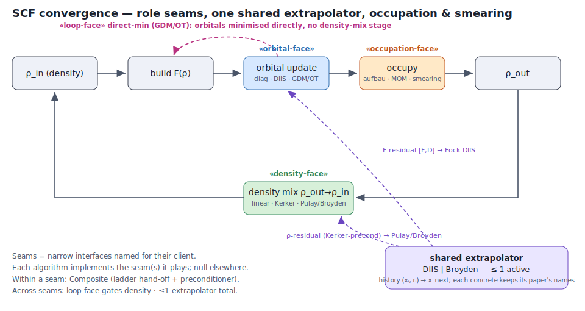

# SCF Convergence Strategy — Role Interfaces, One Shared Extrapolator, Occupation & Smearing

**Self-contained design note.** It defines the abstraction boundaries for SCF convergence acceleration —
Fock-space acceleration (DIIS/GDM), density mixing (linear/Kerker/Pulay/Broyden), occupation policy
(aufbau/MOM/smearing) and the loop mode (fixed-point vs direct-min) — so they compose cleanly instead of
being hardwired inside `tSCFIterator::Iterate`. It supersedes the `0c` sketch in `doc/GPWPlan.md` (the mixer
is one piece of this).



---

## 1. Why

Today all of this lives inline in `tSCFIterator::Iterate`:
- **linear D-mixing** (molecular default): `itsCD->MixIn(itsOldCD, 1−relax)` + inlined adaptive-α heuristics
  ([F,D]-keyed: grow ×1.5 on progress, re-damp ×0.8 + remix on divergence);
- **Kerker ρ̃-mixing** (periodic): `KerkerSetup`/`KerkerUpdate` on `FourierMixCD`;
- **direct-min** (GDM): a separate `WantsLineSearch()` branch, no mixing.

The `tSCFAccelerator<T>` framework already carries **two** roles bundled together (orbital update *and* loop
policy), and density mixing is a third role that isn't an interface at all yet. We want Pulay/Broyden — which
is the same algorithm as the DIIS we already have — so the honest move is to name the seams first.

## 2. The role interfaces (Interface Segregation — named for their client)

| role-interface | client that calls it | the one question it answers | today |
|---|---|---|---|
| **Orbital-face** | the per-irrep orbital update (`tIrrepWF`) | given `F`, `D'` → next orbital rotation `U` | `tSCFIrrepAccelerator` (`UseFD`/`NextOrbitals`/`OrbitalsAt`) |
| **Occupation-face** | the fill step (`tIrrepWF::FillOrbitals`/`TOrbitals::TakeElectrons`) | given eigenvalues → occupations | `TakeElectrons(ne)` (aufbau) + `TakeElectrons(ne, priority)` (MOM) |
| **Density-face** | the `ρ_out→ρ_in` step (`tSCFIterator`) | given `ρ_out`, `ρ_in` → `ρ` that drives the next Fock | inline `MixIn` / `KerkerUpdate` |
| **Loop-face** | the iterator loop (`tSCFIterator`) | fixed-point or direct-min? + convergence signals | `tSCFAccelerator` (`WantsLineSearch`/`SetEnergy`/`GetError`) |

Each **algorithm** implements the seam(s) it plays and inherits a **null** for the rest — the codebase's
dataless-abstract-base / harmless-diamond idiom (`CLAUDE.md`).

| algorithm | Orbital | Occupation | Density | Loop |
|---|---|---|---|---|
| plain SCF | null (diagonalise F) | aufbau | linear α=1 (passthrough) | fixed-point |
| linear mix | null | aufbau | linear + adaptive-α | fixed-point |
| Kerker | null | aufbau | Kerker precond + linear | fixed-point |
| Pulay / Broyden | null | aufbau | Kerker-precond + **extrapolator(ρ)** | fixed-point |
| DIIS | **extrapolator(F)** | aufbau | linear (α=1, or damp) | fixed-point + [F,D] |
| GDM / OT | geodesic / tangent min | aufbau (fixed) | — (bypassed) | **direct-min** |
| MOM | (any) | **max-overlap** | (any) | (any) |
| smearing | (any) | **Fermi/MP fractional** | (any) | (any) — free-energy gate |

The nulls are the point: every client depends only on the one narrow seam it uses.

## 3. How they combine (this is what fixes the injection model)

**Within a seam → Composite** (lives *in* the column, the iterator never orchestrates it):
- **hand-off ladder** — the existing `SCFAcceleratorLadder` (Null→DIIS→GDM) is exactly this for the
  orbital-face; the density-face wants the same (robust linear/Kerker early → Pulay/Broyden near convergence;
  "restart the history when the residual grows" is a soft hand-off). So a `DensityLadder` is a legitimate
  sibling of the orbital `Ladder`.
- **preconditioner decorator** — Kerker is a *preconditioner* (`G²/(G²+G0²)` on the residual), not a peer of
  Pulay: "Kerker-preconditioned Broyden" = Kerker **wrapping** the history method. A decorator, not a hand-off.
- **the density-face has no `Null` concrete** — passthrough is just `LinearMixer(α=1)`
  (`ρ_next = ρ_in + 1·(ρ_out−ρ_in) = ρ_out`), and `SCFParams::StartingRelaxRo` already defaults to 1.0, so
  "no mixing" and "the molecular default" are the *same object*. The whole column then factors as
  **{preconditioner: identity | Kerker} × {step: linear α | extrapolated}**, with Null = (identity, linear
  α=1) as the trivial corner, Kerker = (Kerker, linear α), Pulay/Broyden = (·, extrapolated). (The Null
  *idiom* still holds for the orbital / occupation / loop seams — only the density seam collapses this way,
  because its identity element is itself a real mixing operation.)

**Across seams → two couplings, and only two:**
- **loop-face gates density-face (asymmetric).** GDM/OT assert direct-min → the density stage does not exist
  (there is no `ρ_out→ρ_in` in a line search). The orbital/loop side *overrides* the density side; the density
  side never reaches back (its residual is just densities; Kerker's metric comes from the basis). This is a
  genuine dependency, mediated cleanly by the loop-face. **This is option-2 (asymmetric) — and it is natural,
  because direct-min genuinely has no density stage; forcing a density-face onto it would be fiction.**
- **≤ 1 extrapolator total.** DIIS (on the `F` residual `[F,D]`) and Pulay/Broyden (on the `ρ` residual
  `ρ_out−ρ_in`) are the **same quasi-Newton engine on different residual streams** — you want at most one, or
  two Jacobian estimators fight. **This is option-1 (orthogonality) — and it is natural, not forced: it is
  literally one algorithm, so making it one object *removes* a duplication.**

Everything else is freely orthogonal: plain-diag × any mixer; DIIS × linear/Kerker **damping** (damping is not
a history method, so it composes with F-DIIS — that is what molecular runs today).

## 4. The shared extrapolator — and paper-faithful naming

The single-extrapolator idea does **not** ask one class to represent two papers with clashing notation.
DIIS (Pulay) and Broyden are *different algorithms* (least-squares over an error-overlap `B` vs an
inverse-Jacobian update `G`); they are **separate concretes**, each faithful to its own paper. Only the thin
**seam** is neutral:

```
interface Extrapolator<T>:                     // role-neutral names ONLY here
    push(x_i, r_i)          // x_i = the iterate (F or ρ̃), r_i = its residual
    x_next  extrapolate()   // the accelerated next iterate
    reset()
    // the inner product <r_i, r_j> is supplied by the STREAM (S-metric for F, Kerker-weighted for ρ)
```

- `DIIS_Extrapolator` keeps **Pulay's** names verbatim: the error-overlap matrix `B`, coefficients `c`, the
  Lagrange multiplier `λ`, the bordered system — with `// Pulay 1980, Eq (6)`-style comments (extracted, not
  rewritten, from today's `cSCFAcceleratorDIIS` — its existing paper references travel with the code).
- `Broyden_Extrapolator` keeps **Johnson's** names: the inverse-Jacobian `G`, the update vectors `u_i`/`v_i`,
  the weights `w_i`/`w_0` — with `// Johnson 1988, Eq (n)` comments.
- The two **adapters** feed the streams and own nothing but plumbing:
  - `cSCFAcceleratorDIIS` becomes a thin orbital-face adapter: feed `(F, [F,D])` into a `DIIS_Extrapolator`.
  - `PulayMixer` is the density-face adapter: feed `(ρ̃, ρ_out−ρ_in)` into the SAME `DIIS_Extrapolator`,
    with the Kerker preconditioner on the residual.

So **one** paper-faithful DIIS implementation serves both the Fock accelerator and the density mixer; the
"different papers, different names" problem never arises because different algorithms stay in different
classes. A one-line mapping comment at each adapter records `x≡F | ρ̃`, `r≡[F,D] | ρ_out−ρ_in`.

**Pin:** role-neutral names at the seam, paper-verbatim names + equation refs inside every concrete. Never
launder a paper's `B`/`c`/`λ` or `G`/`u`/`v` into generic mush.

## 5. Occupation policy + thermal smearing (the extensibility requirement)

Occupation is **already its own seam** — this session's MOM work put it there:
`TOrbitals::TakeElectrons(ne, priority)` + `tIrrepWF::FillOrbitals`, driven by `SCFParams::UseMOM/MOMStartIter`.
The concretes are **aufbau** (integer, lowest-first), **MOM** (max-overlap onto a fixed reference), and —
the extension — **Fermi/Methfessel-Paxton smearing** (fractional `f_i = f(ε_i, μ, T)`).

Smearing slots into the same seam, and the infrastructure is already half-present:
- `TakeElectrons` already carries a **fractional** occupation (`itsOccupation` is a `double`, `min(g,n)`), so a
  smeared fill is "set `f_i` from `ε_i` and a Fermi level `μ`" rather than lowest-first.
- What it adds: a **μ solver** (bisection on `Σ_i f_i(ε_i,μ,T) = N_e`, per k-block / spin channel), and the
  **free-energy** correction — smearing minimises `Ω = E − TS` (Mermin), so the loop-face's energy gate becomes
  the free energy and the entropy `S = −k_B Σ [f ln f + (1−f) ln(1−f)]` (or the MP analogue) is added to the
  reported energy. So smearing touches the **occupation-face** (the `f_i`) *and* the **loop-face** (free-energy
  gate) — exactly the two-seam span the role model expects, no new machinery.
- Interaction to record: **smearing vs direct-min** — OT with fractional occupations is the CP2K
  "OT+smearing" special case (a coupled orbital+occupation minimisation); plain aufbau-OT/GDM is
  integer-occupation only. So the {occupation-face} × {loop-face:direct-min} cell is the one that needs care
  later — flagged, not solved here.

**Pin:** occupation is a first-class seam (aufbau/MOM/smearing are siblings); smearing = fractional-occupation
concrete + μ-solver + free-energy gate; do not special-case it into the fill.

## 6. Injection model

One **slot per role** on the iterator, each defaulting to a shared **Null** (except the density slot, whose
"do nothing" is `LinearMixer(α=1)` — §3, no separate Null concrete):
- a **spanning** algorithm (GDM/OT) is ONE object dropped into several slots — it IS-A orbital-face and
  loop-face; that is a "bundle";
- **composition** is different objects in different slots — DIIS in orbital + Kerker in density (the current
  molecular "extrapolate + damp");
- within-column combination is a **Composite** in the slot (ladder/decorator), never the iterator's job;
- the two cross-seam couplings: the loop-face override is structural (direct-min ⇒ the iterator skips the
  density slot); "≤1 extrapolator" is structural once the extrapolator is one object on one stream. A
  belt-and-suspenders facade check can warn on a double-extrapolator mis-wire.
- construction mirrors the just-landed MOM plumbing: the facade/`SCFParams` chooses the concretes; low-level
  test call sites keep working because the iterator builds the `SCFParams`-implied default when nothing is
  injected (Kerker needs `G0`, which arrives with `SCFParams`, not at ctor — same reason `SetMOM` is pushed at
  `Iterate` time).

## 7. OT as a future direct-min concrete

CP2K's OT (Orbital Transformation) is the **same role** as GDM: a direct minimiser over the occupied subspace
(`C(X)=C₀cos U + X U⁻¹ sin U`, `U=(X†SX)^½`, `X†SC₀=0` — exact constraint, preconditioned CG). Identical
role-signature to GDM (orbital-face = tangent min, loop-face = direct-min, density-face = bypassed), a
**preconditioned upgrade** in the same slot. Two independent direct-min algorithms collapsing onto one
signature is the sign the cut is right. Strategically it is the O(N)/large-cell path (battery-oxide north-star,
[[project_battery_voltage_goal]]) and CP2K's own answer to charge-transfer instabilities (no density stage →
no occupation-swap pathology). Caveats: occupied-only, no eigenspectrum without a separate diagonalisation
(matters for the band-gap instrument), metals need OT+smearing (§5).

## 8. Increment plan (refactor-first, bit-identical oracle)

1. **Extract the seams, behaviour-preserving.**
   - **1a — density-face: DONE** (`f4f48431`).  New module `qchem.ChargeDensity.DensityMixer` (qcChargeDensity,
     no new lib edges) with `tDensityMixer<T>` + `LinearMixer` (adaptive-α; α=1 = passthrough, **no NullMixer**)
     + `KerkerMixer` (ex-`KerkerSetup`/`Update`) + `MakeDensityMixer<T>`.  The iterator builds it from SCFParams
     at the top of `Iterate` (like the MOM plumbing) and its fixed-point branch collapses to
     `Mix`/`FockDensity`; the iterator keeps the density LIFECYCLE (SetWorkingCD/lineage), the mixer owns the
     policy+state.  **BIT-IDENTICAL: 198/198 (-A_*) + the NaF Kerker trace byte-for-byte.**
   - **1b — loop-face driver: DONE** (`388b33d3`).  New module `qchem.SCFIterator.LoopDriver`:
     `tLoopDriver<T>::Step(LoopContext<T>)` + `FixedPointDriver` / `DirectMinDriver`.  The `if
     (WantsLineSearch())` mode conditional → the iterator selects a driver by the accelerator's mode and
     calls `Step()` (virtual dispatch; the density lifecycle stays behind two `LoopContext` callbacks).
     Dead `SetDirectMin`/`itsDirectMin` removed.  **KEY DAG CONSTRAINT:** the driver lives at the iterator
     level, NOT on the accelerator — the accelerator sits below the wf/mixer/Hamiltonian (imports only
     `Symmetry.Irrep` + `LASolver`), so full Tell-Don't-Ask (accelerator performs the step) would invert the
     DAG; it reports the MODE, the iterator selects.  BIT-IDENTICAL: 200/200 (full) + direct-min verified via
     `scfrun --accel directmin` (stable −14.55693664) + inspection.
     - *Not done (deferred, lower value):* the ISP split of the loop-face SIGNALS
       (`SetEnergy`/`GetError`/`ShowConvergence`/`WantsLineSearch`) into their own interface separate from the
       orbital-face on `tSCFAccelerator`.  The polymorphic dispatch (the valuable part) is done; the interface
       tidy can follow when it earns its keep.
2. **Shared extrapolator + density Pulay.** Extract the DIIS math out of `cSCFAcceleratorDIIS` into a
   paper-faithful `DIIS_Extrapolator`; make `cSCFAcceleratorDIIS` a thin adapter; add `PulayMixer` (density-DIIS
   with Kerker preconditioner) as a `tDensityMixer` concrete. **Gate: NaF Ecut=40 kills the residual iter-19
   mixing spike + accelerates the tail vs the −27.93 oracle.**
3. **Broyden.** `Broyden_Extrapolator` (Johnson) sibling; density-face `BroydenMixer` adapter. Compare on NaF.
4. **Occupation seam formalisation + Fermi smearing** (§5): μ-solver + free-energy gate; keep MOM/aufbau as
   siblings. Later — needed for metals and the OT+smearing path.
5. **OT direct-min concrete** (§7). Later.

## 9. Paper references (keep these in the concretes, with equation numbers where possible)

- **DIIS / Pulay mixing** — P. Pulay, *Chem. Phys. Lett.* **73**, 393 (1980); P. Pulay, *J. Comput. Chem.*
  **3**, 556 (1982).
- **Kerker preconditioner** — G. P. Kerker, *Phys. Rev. B* **23**, 3082 (1981).
- **Modified Broyden mixing** — D. D. Johnson, *Phys. Rev. B* **38**, 12807 (1988) (after C. G. Broyden,
  *Math. Comput.* **19**, 577 (1965)).
- **MOM** — A. T. B. Gilbert, N. A. Besley, P. M. W. Gill, *J. Phys. Chem. A* **112**, 13164 (2008).
- **OT (orbital transformation)** — J. VandeVondele, J. Hutter, *J. Chem. Phys.* **118**, 4365 (2003).
- **Finite-T DFT / smearing free energy** — N. D. Mermin, *Phys. Rev.* **137**, A1441 (1965);
  M. Methfessel, A. T. Paxton, *Phys. Rev. B* **40**, 3616 (1989).

## 10. Invariants / pins

- **Seams named for the client** (orbital / occupation / density / loop); algorithms implement the seam(s)
  they play, null elsewhere (dataless abstract bases — the codebase idiom).
- **≤ 1 extrapolator, on one residual stream** — DIIS(F) *or* Pulay/Broyden(ρ), never both.
- **loop-face overrides density-face**; the density-face never depends on the orbital-face (one-way coupling).
- **paper-verbatim names inside concretes**, role-neutral names at seams; never merge two papers into one class.
- **occupation is a first-class seam**; smearing = fractional concrete + μ-solver + free-energy gate.
- **no `NullMixer`** — the density-face "do nothing" is `LinearMixer(α=1)` (passthrough); the column factors
  as {preconditioner} × {linear | extrapolated step}. `StartingRelaxRo` defaults to 1.0, so no-mixing and the
  molecular default are one object.
- **bit-identity is the extraction oracle** (increment 1); periodic energies stay did-E-move anchors.
